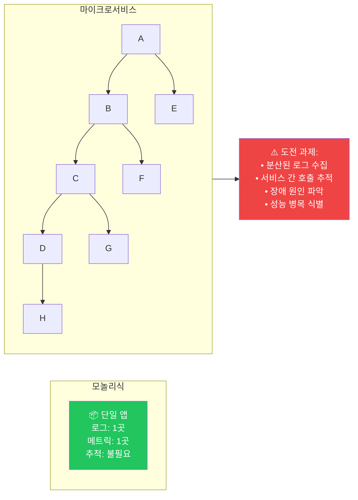
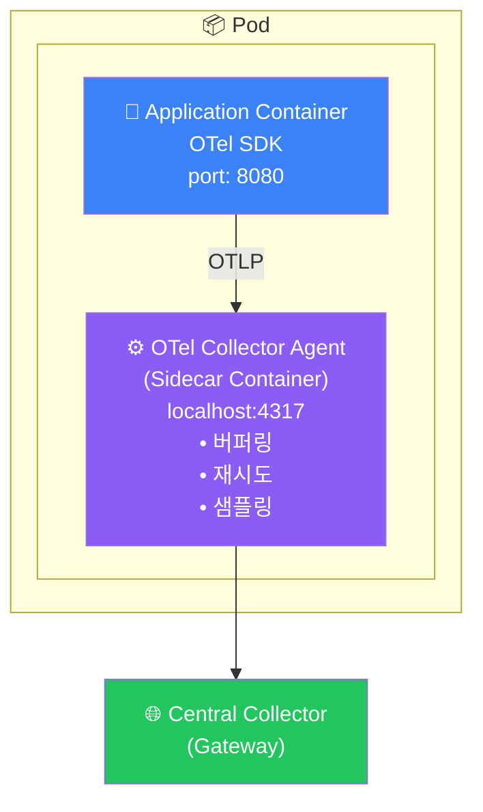
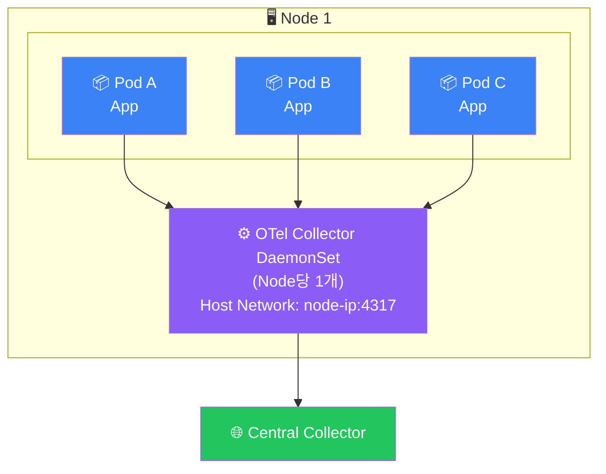
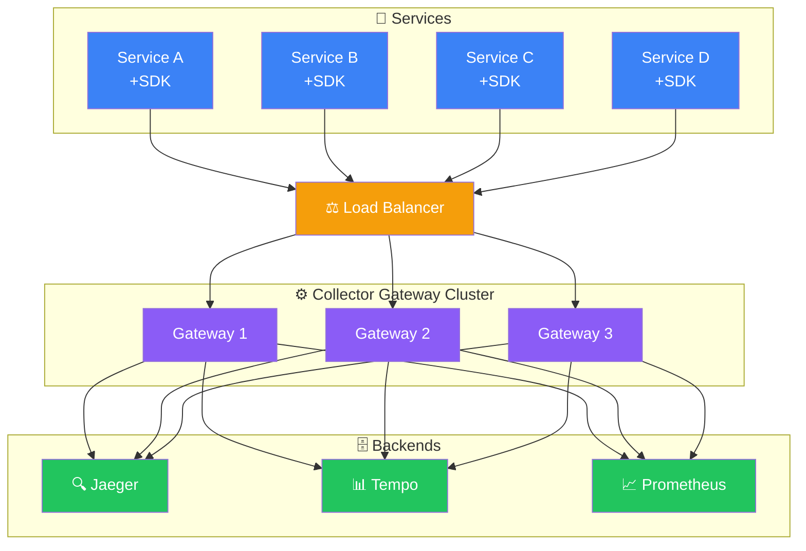
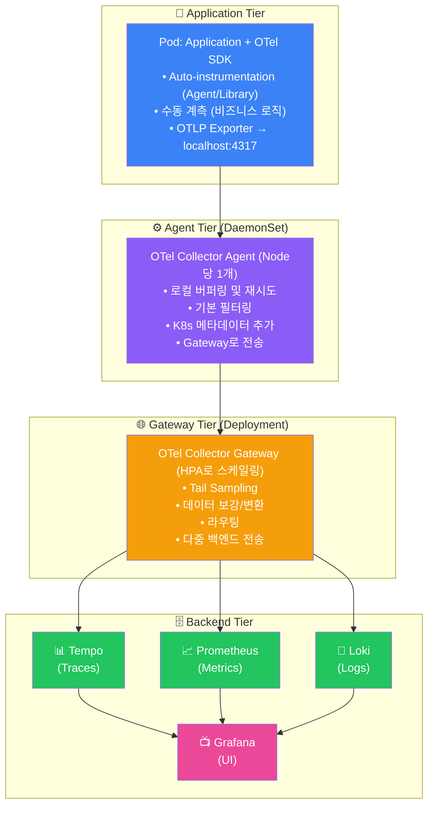
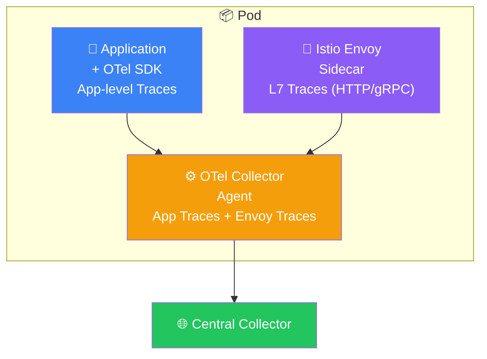
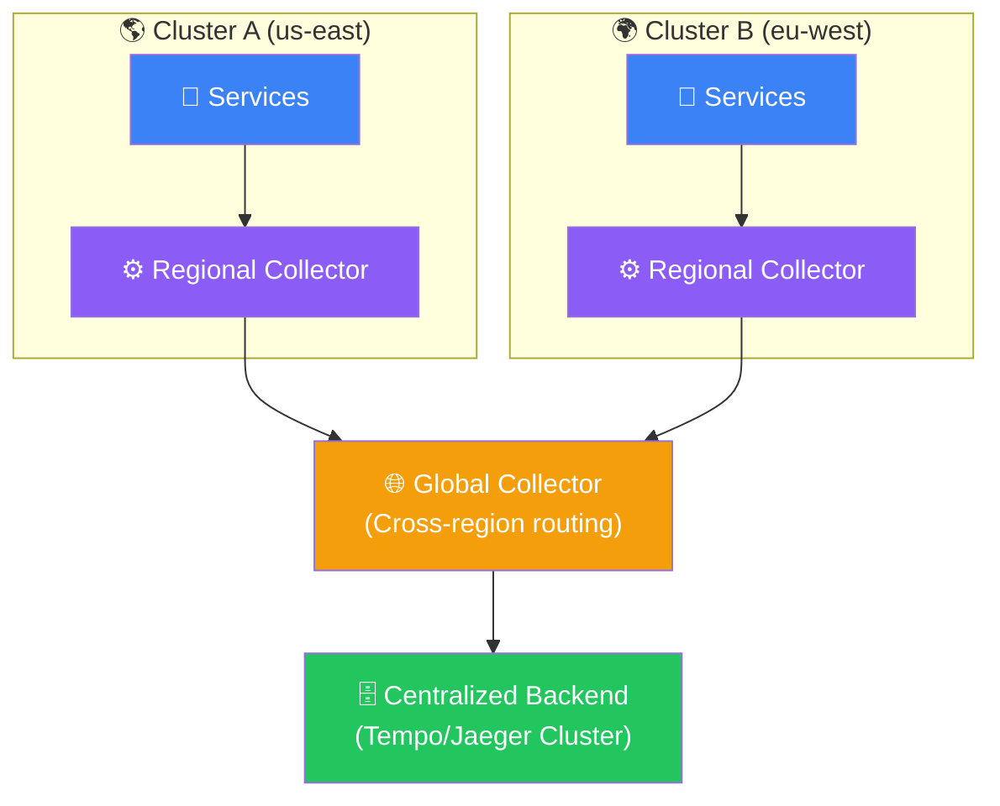

# MSA 아키텍처 설계


## MSA 환경의 관측 가능성 도전 과제



## 아키텍처 패턴

### 패턴 1: 사이드카 패턴 (Kubernetes)



**장점:**
- 앱과 Collector 독립적 스케일링
- 앱 재시작 없이 Collector 설정 변경
- localhost 통신으로 낮은 지연

**단점:**
- Pod당 추가 리소스 사용
- 운영 복잡도 증가

#### Kubernetes 매니페스트

```yaml
# deployment.yaml
apiVersion: apps/v1
kind: Deployment
metadata:
  name: order-service
spec:
  replicas: 3
  template:
    spec:
      containers:
        # 애플리케이션 컨테이너
        - name: order-service
          image: order-service:1.0.0
          ports:
            - containerPort: 8080
          env:
            - name: OTEL_EXPORTER_OTLP_ENDPOINT
              value: "http://localhost:4317"
            - name: OTEL_SERVICE_NAME
              value: "order-service"
            - name: OTEL_RESOURCE_ATTRIBUTES
              value: "k8s.namespace.name=$(K8S_NAMESPACE),k8s.pod.name=$(K8S_POD_NAME)"
            - name: K8S_NAMESPACE
              valueFrom:
                fieldRef:
                  fieldPath: metadata.namespace
            - name: K8S_POD_NAME
              valueFrom:
                fieldRef:
                  fieldPath: metadata.name

        # OTel Collector 사이드카
        - name: otel-collector
          image: otel/opentelemetry-collector-contrib:0.91.0
          args: ["--config=/etc/otel-collector-config.yaml"]
          ports:
            - containerPort: 4317
          volumeMounts:
            - name: otel-config
              mountPath: /etc/otel-collector-config.yaml
              subPath: otel-collector-config.yaml
          resources:
            limits:
              cpu: 200m
              memory: 256Mi
            requests:
              cpu: 100m
              memory: 128Mi

      volumes:
        - name: otel-config
          configMap:
            name: otel-collector-config
```

### 패턴 2: DaemonSet 패턴



**장점:**
- 노드당 하나의 Collector로 리소스 효율적
- 간단한 운영

**단점:**
- 노드 레벨 장애 시 영향 범위가 큼
- Pod별 세밀한 설정 어려움

#### DaemonSet 매니페스트

```yaml
# otel-collector-daemonset.yaml
apiVersion: apps/v1
kind: DaemonSet
metadata:
  name: otel-collector-agent
  namespace: monitoring
spec:
  selector:
    matchLabels:
      app: otel-collector-agent
  template:
    metadata:
      labels:
        app: otel-collector-agent
    spec:
      hostNetwork: true
      containers:
        - name: otel-collector
          image: otel/opentelemetry-collector-contrib:0.91.0
          args: ["--config=/etc/otel-collector-config.yaml"]
          env:
            - name: K8S_NODE_NAME
              valueFrom:
                fieldRef:
                  fieldPath: spec.nodeName
          ports:
            - containerPort: 4317
              hostPort: 4317
          volumeMounts:
            - name: config
              mountPath: /etc/otel-collector-config.yaml
              subPath: otel-collector-config.yaml
          resources:
            limits:
              cpu: 500m
              memory: 512Mi
      volumes:
        - name: config
          configMap:
            name: otel-collector-agent-config
```

### 패턴 3: 중앙 집중식 Gateway



**장점:**
- 중앙 집중식 관리 및 모니터링
- 복잡한 라우팅 및 변환 가능
- 백엔드 변경이 용이

**단점:**
- 네트워크 지연
- 단일 장애점 (미티게이션 필요)

## 권장 아키텍처: 하이브리드 방식



## 서비스별 계측 전략

### API Gateway

```yaml
# API Gateway 계측 포인트
계측 대상:
  - 모든 인바운드 요청
  - 인증/인가 처리
  - 라우팅 결정
  - 요청/응답 변환

속성:
  - gateway.route: "/api/v1/orders"
  - gateway.upstream: "order-service"
  - auth.user_id: "user123"
  - rate_limit.remaining: 95
```

### 비즈니스 서비스

```python
# Order Service 계측 예시
from opentelemetry import trace

tracer = trace.get_tracer("order-service")

class OrderService:
    def create_order(self, order_data):
        with tracer.start_as_current_span("create-order") as span:
            # 비즈니스 속성
            span.set_attribute("order.type", order_data.type)
            span.set_attribute("order.item_count", len(order_data.items))
            span.set_attribute("order.total_amount", order_data.total)

            # 재고 확인
            with tracer.start_as_current_span("check-inventory"):
                inventory_result = self.inventory_client.check(order_data.items)
                span.set_attribute("inventory.available", inventory_result.available)

            # 결제 처리
            with tracer.start_as_current_span("process-payment"):
                payment_result = self.payment_client.charge(order_data.payment)
                span.set_attribute("payment.transaction_id", payment_result.id)

            # 주문 저장
            with tracer.start_as_current_span("save-order"):
                order = self.repository.save(order_data)

            span.set_attribute("order.id", order.id)
            return order
```

### 데이터베이스 계층

```yaml
# DB 계측 속성 (Semantic Conventions)
db.system: "postgresql"
db.name: "orders_db"
db.operation: "SELECT"
db.statement: "SELECT * FROM orders WHERE user_id = ?"
db.sql.table: "orders"
db.connection_string: "postgresql://host:5432/orders_db"
```

### 메시지 큐

```python
# Kafka Producer 계측
with tracer.start_as_current_span(
    "kafka-produce",
    kind=trace.SpanKind.PRODUCER
) as span:
    span.set_attribute("messaging.system", "kafka")
    span.set_attribute("messaging.destination", "order-events")
    span.set_attribute("messaging.destination_kind", "topic")
    span.set_attribute("messaging.message_id", message_id)

    # Context propagation
    headers = {}
    inject(headers)
    producer.send(topic, message, headers=headers)
```

## 서비스 메시 통합 (Istio)

```yaml
# Istio + OTel 통합
apiVersion: install.istio.io/v1alpha1
kind: IstioOperator
spec:
  meshConfig:
    enableTracing: true
    defaultConfig:
      tracing:
        zipkin:
          address: otel-collector.monitoring:9411
        sampling: 100.0

    extensionProviders:
      - name: otel
        opentelemetry:
          service: otel-collector.monitoring.svc.cluster.local
          port: 4317
```



> **결과**: Application Traces + Service Mesh Traces 통합

## 멀티 클러스터 / 멀티 리전 아키텍처



> **Cross-region trace 예시:** User → us-east/gateway → eu-west/service → us-east/db

## 다음 단계

- [샘플링 전략](./sampling-strategies) - 비용 효율적인 샘플링
- [프로덕션 배포](./production-deployment) - 프로덕션 배포 가이드
