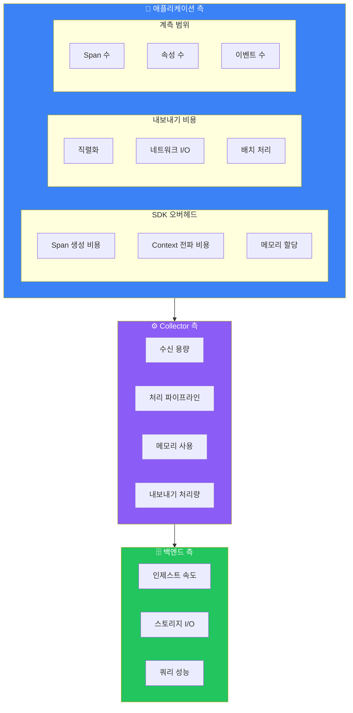

# 성능 최적화

## 성능 영향 요소



## SDK 최적화

### 배치 설정 최적화

```python
# Python SDK 배치 최적화
from opentelemetry.sdk.trace.export import BatchSpanProcessor

processor = BatchSpanProcessor(
    exporter,
    # 배치 설정
    max_queue_size=2048,           # 큐 최대 크기
    schedule_delay_millis=5000,     # 배치 전송 간격 (ms)
    max_export_batch_size=512,      # 배치당 최대 span 수
    export_timeout_millis=30000,    # 내보내기 타임아웃
)
```

```javascript
// Node.js SDK 배치 최적화
const { BatchSpanProcessor } = require('@opentelemetry/sdk-trace-base');

const processor = new BatchSpanProcessor(exporter, {
  maxQueueSize: 2048,
  maxExportBatchSize: 512,
  scheduledDelayMillis: 5000,
  exportTimeoutMillis: 30000,
});
```

```java
// Java SDK 배치 최적화
BatchSpanProcessor processor = BatchSpanProcessor.builder(exporter)
    .setMaxQueueSize(2048)
    .setMaxExportBatchSize(512)
    .setScheduleDelay(Duration.ofSeconds(5))
    .setExporterTimeout(Duration.ofSeconds(30))
    .build();
```

### 샘플러 최적화

```python
# 불필요한 span 조기 필터링
from opentelemetry.sdk.trace.sampling import Sampler, SamplingResult, Decision

class OptimizedSampler(Sampler):
    def should_sample(self, parent_context, trace_id, name, kind, attributes, links):
        # 헬스체크는 즉시 드롭
        if attributes and attributes.get("http.target") in ["/health", "/ready"]:
            return SamplingResult(Decision.DROP)

        # 부모의 샘플링 결정 따르기
        parent_span = trace.get_current_span(parent_context)
        if parent_span and parent_span.is_recording():
            return SamplingResult(Decision.RECORD_AND_SAMPLE)

        # 10% 확률 샘플링
        if hash(str(trace_id)) % 100 < 10:
            return SamplingResult(Decision.RECORD_AND_SAMPLE)

        return SamplingResult(Decision.DROP)
```

### 속성 최적화

```python
# ❌ 비효율적: 불필요한 대용량 데이터
span.set_attribute("request.body", large_request_body)  # 수 MB 가능
span.set_attribute("response.body", large_response_body)

# ✅ 효율적: 필요한 정보만
span.set_attribute("request.body_size", len(request_body))
span.set_attribute("response.status_code", 200)

# ❌ 비효율적: 동적 키
for i, item in enumerate(items):
    span.set_attribute(f"item.{i}.name", item.name)  # 가변 속성 수

# ✅ 효율적: 집계된 정보
span.set_attribute("items.count", len(items))
span.set_attribute("items.total_value", sum(i.value for i in items))
```

### 비동기 내보내기

```python
# 비동기 Exporter 사용
from opentelemetry.exporter.otlp.proto.grpc.trace_exporter import OTLPSpanExporter

# gRPC는 기본적으로 비동기
exporter = OTLPSpanExporter(
    endpoint="collector:4317",
    insecure=True,
    compression=Compression.Gzip,  # 압축 활성화
)
```

## Collector 최적화

### 리소스 설정

```yaml
# 리소스 기반 설정 계산
# 예상 처리량: 10,000 spans/sec
# 권장 메모리: 처리량 * 10KB * 버퍼_초 = 10,000 * 10KB * 30s = 3GB

processors:
  memory_limiter:
    check_interval: 1s
    limit_mib: 3000
    spike_limit_mib: 500
    limit_percentage: 0
    spike_limit_percentage: 0

  batch:
    timeout: 5s
    send_batch_size: 10000
    send_batch_max_size: 11000
```

### 파이프라인 최적화

```yaml
# 프로세서 순서 최적화
service:
  pipelines:
    traces:
      receivers: [otlp]
      processors:
        # 1. 메모리 보호 (최우선)
        - memory_limiter
        # 2. 조기 필터링 (데이터 감소)
        - filter
        # 3. 속성 처리
        - attributes
        # 4. 샘플링 (데이터 감소)
        - tail_sampling
        # 5. 배치 처리 (마지막)
        - batch
      exporters: [otlp]
```

### 병렬 처리

```yaml
# 다중 파이프라인으로 병렬 처리
service:
  pipelines:
    # 중요 서비스 파이프라인
    traces/critical:
      receivers: [otlp]
      processors: [memory_limiter, filter/critical, batch]
      exporters: [otlp/tempo]

    # 일반 서비스 파이프라인
    traces/standard:
      receivers: [otlp]
      processors: [memory_limiter, filter/standard, tail_sampling, batch]
      exporters: [otlp/tempo]
```

### gRPC 튜닝

```yaml
receivers:
  otlp:
    protocols:
      grpc:
        endpoint: 0.0.0.0:4317
        max_recv_msg_size_mib: 16
        max_concurrent_streams: 100
        read_buffer_size: 524288
        write_buffer_size: 524288
        keepalive:
          server_parameters:
            max_connection_idle: 11s
            max_connection_age: 30s
            time: 30s
            timeout: 5s

exporters:
  otlp:
    endpoint: tempo:4317
    compression: gzip
    sending_queue:
      enabled: true
      num_consumers: 20
      queue_size: 10000
```

## 벤치마크 및 측정

### Collector 자체 메트릭

```promql
# 처리량
sum(rate(otelcol_receiver_accepted_spans[5m]))

# 지연 시간
histogram_quantile(0.99, rate(otelcol_exporter_send_latency_bucket[5m]))

# 큐 대기 시간
histogram_quantile(0.95, rate(otelcol_exporter_queue_latency_bucket[5m]))

# 드롭된 span
sum(rate(otelcol_processor_dropped_spans[5m]))

# 메모리 사용
process_resident_memory_bytes{job="otel-collector"}
```

### 애플리케이션 영향 측정

```python
# Python에서 오버헤드 측정
import time
from opentelemetry import trace

tracer = trace.get_tracer(__name__)

# 계측 없이 실행
start = time.perf_counter()
for _ in range(10000):
    do_work()
baseline = time.perf_counter() - start

# 계측과 함께 실행
start = time.perf_counter()
for _ in range(10000):
    with tracer.start_as_current_span("test"):
        do_work()
with_tracing = time.perf_counter() - start

overhead_percent = ((with_tracing - baseline) / baseline) * 100
print(f"Tracing overhead: {overhead_percent:.2f}%")
```

### 로드 테스트

```yaml
# k6 로드 테스트 설정
# load-test.js
import http from 'k6/http';
import { check } from 'k6';

export const options = {
  stages: [
    { duration: '2m', target: 100 },   // 워밍업
    { duration: '5m', target: 500 },   // 부하 증가
    { duration: '10m', target: 1000 }, // 피크 부하
    { duration: '2m', target: 0 },     // 쿨다운
  ],
};

export default function () {
  const res = http.get('http://app:8080/api/orders');
  check(res, {
    'status is 200': (r) => r.status === 200,
    'response time < 500ms': (r) => r.timings.duration < 500,
  });
}
```

## 환경별 최적화 권장사항

### 개발 환경

```yaml
# 빠른 피드백을 위한 설정
processors:
  batch:
    timeout: 1s
    send_batch_size: 100

exporters:
  logging:
    verbosity: detailed
```

### 스테이징 환경

```yaml
# 프로덕션과 유사하지만 더 낮은 리소스
processors:
  memory_limiter:
    limit_mib: 1000

  batch:
    timeout: 2s
    send_batch_size: 1000

  tail_sampling:
    policies:
      - name: probabilistic
        type: probabilistic
        probabilistic:
          sampling_percentage: 50
```

### 프로덕션 환경

```yaml
# 최적화된 프로덕션 설정
processors:
  memory_limiter:
    limit_mib: 4000
    spike_limit_mib: 800

  batch:
    timeout: 5s
    send_batch_size: 10000

  tail_sampling:
    num_traces: 500000
    policies:
      - name: errors
        type: status_code
        status_code:
          status_codes: [ERROR]
      - name: probabilistic
        type: probabilistic
        probabilistic:
          sampling_percentage: 10
```

## 성능 튜닝 체크리스트

### SDK 레벨
- [ ] 적절한 샘플러 설정
- [ ] 배치 크기 최적화
- [ ] 불필요한 속성 제거
- [ ] gzip 압축 활성화
- [ ] 비동기 내보내기 사용

### Collector 레벨
- [ ] Memory Limiter 설정
- [ ] 적절한 배치 크기
- [ ] 프로세서 순서 최적화
- [ ] 큐 크기 조정
- [ ] 압축 활성화

### 인프라 레벨
- [ ] 충분한 CPU/메모리 할당
- [ ] 네트워크 지연 최소화
- [ ] 로드 밸런싱 설정
- [ ] 수평 확장 준비

### 모니터링
- [ ] Collector 메트릭 수집
- [ ] 알림 설정
- [ ] 정기적인 성능 검토

## 다음 단계

- [보안](./security) - 보안 강화 가이드
- [트러블슈팅](./troubleshooting) - 문제 해결 가이드
