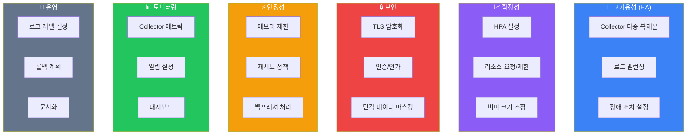

# 프로덕션 배포

## 프로덕션 체크리스트



## 고가용성 아키텍처

### Kubernetes 배포

```yaml
# otel-collector-gateway.yaml
apiVersion: apps/v1
kind: Deployment
metadata:
  name: otel-collector-gateway
  namespace: monitoring
spec:
  replicas: 3  # 최소 3개 복제본
  strategy:
    type: RollingUpdate
    rollingUpdate:
      maxSurge: 1
      maxUnavailable: 0  # 무중단 배포
  selector:
    matchLabels:
      app: otel-collector-gateway
  template:
    metadata:
      labels:
        app: otel-collector-gateway
      annotations:
        prometheus.io/scrape: "true"
        prometheus.io/port: "8888"
    spec:
      affinity:
        # Pod 분산 배치
        podAntiAffinity:
          preferredDuringSchedulingIgnoredDuringExecution:
            - weight: 100
              podAffinityTerm:
                labelSelector:
                  matchLabels:
                    app: otel-collector-gateway
                topologyKey: kubernetes.io/hostname
      containers:
        - name: otel-collector
          image: otel/opentelemetry-collector-contrib:0.91.0
          args: ["--config=/etc/otel-collector-config.yaml"]
          ports:
            - containerPort: 4317
              name: otlp-grpc
            - containerPort: 4318
              name: otlp-http
            - containerPort: 8888
              name: metrics
            - containerPort: 13133
              name: health
          resources:
            requests:
              cpu: 500m
              memory: 1Gi
            limits:
              cpu: 2000m
              memory: 4Gi
          livenessProbe:
            httpGet:
              path: /
              port: 13133
            initialDelaySeconds: 10
            periodSeconds: 10
          readinessProbe:
            httpGet:
              path: /
              port: 13133
            initialDelaySeconds: 5
            periodSeconds: 5
          volumeMounts:
            - name: config
              mountPath: /etc/otel-collector-config.yaml
              subPath: otel-collector-config.yaml
      volumes:
        - name: config
          configMap:
            name: otel-collector-config

---
apiVersion: v1
kind: Service
metadata:
  name: otel-collector-gateway
  namespace: monitoring
spec:
  type: ClusterIP
  ports:
    - name: otlp-grpc
      port: 4317
      targetPort: 4317
    - name: otlp-http
      port: 4318
      targetPort: 4318
  selector:
    app: otel-collector-gateway

---
apiVersion: autoscaling/v2
kind: HorizontalPodAutoscaler
metadata:
  name: otel-collector-gateway
  namespace: monitoring
spec:
  scaleTargetRef:
    apiVersion: apps/v1
    kind: Deployment
    name: otel-collector-gateway
  minReplicas: 3
  maxReplicas: 10
  metrics:
    - type: Resource
      resource:
        name: cpu
        target:
          type: Utilization
          averageUtilization: 70
    - type: Resource
      resource:
        name: memory
        target:
          type: Utilization
          averageUtilization: 80
```

### PodDisruptionBudget

```yaml
# pdb.yaml
apiVersion: policy/v1
kind: PodDisruptionBudget
metadata:
  name: otel-collector-gateway-pdb
  namespace: monitoring
spec:
  minAvailable: 2
  selector:
    matchLabels:
      app: otel-collector-gateway
```

## 프로덕션 Collector 설정

```yaml
# production-collector-config.yaml
extensions:
  health_check:
    endpoint: 0.0.0.0:13133
    path: /health/status
    check_collector_pipeline:
      enabled: true
      interval: 5m

  pprof:
    endpoint: 0.0.0.0:1777

  zpages:
    endpoint: 0.0.0.0:55679

receivers:
  otlp:
    protocols:
      grpc:
        endpoint: 0.0.0.0:4317
        max_recv_msg_size_mib: 16
        max_concurrent_streams: 100
        read_buffer_size: 524288
        write_buffer_size: 524288
        keepalive:
          server_parameters:
            max_connection_idle: 11s
            max_connection_age: 30s
            max_connection_age_grace: 5s
            time: 30s
            timeout: 5s
          enforcement_policy:
            min_time: 5s
            permit_without_stream: true
      http:
        endpoint: 0.0.0.0:4318
        max_request_body_size: 16777216  # 16MB

processors:
  # 1. 메모리 보호 (최우선)
  memory_limiter:
    check_interval: 1s
    limit_mib: 3500
    spike_limit_mib: 700
    limit_percentage: 85
    spike_limit_percentage: 15

  # 2. 배치 처리
  batch:
    timeout: 5s
    send_batch_size: 10000
    send_batch_max_size: 11000

  # 3. 리소스 탐지 (K8s 환경)
  resourcedetection:
    detectors: [env, system, gcp, aws, azure]
    timeout: 5s
    override: false

  k8sattributes:
    auth_type: serviceAccount
    passthrough: false
    extract:
      metadata:
        - k8s.pod.name
        - k8s.pod.uid
        - k8s.deployment.name
        - k8s.namespace.name
        - k8s.node.name
        - k8s.cluster.name
      labels:
        - tag_name: app
          key: app.kubernetes.io/name
        - tag_name: version
          key: app.kubernetes.io/version
        - tag_name: component
          key: app.kubernetes.io/component

  # 4. 민감 정보 제거
  attributes:
    actions:
      - key: http.request.header.authorization
        action: delete
      - key: http.request.header.cookie
        action: delete
      - key: db.statement
        action: hash  # SQL 해시화
      - key: user.email
        pattern: ^(?P<user>[^@]+)@(?P<domain>.+)$
        action: extract
      - key: user.email
        action: delete

  # 5. 필터링
  filter:
    traces:
      span:
        - 'attributes["http.target"] == "/health"'
        - 'attributes["http.target"] == "/ready"'
        - 'attributes["http.target"] == "/metrics"'

  # 6. Tail Sampling
  tail_sampling:
    decision_wait: 30s
    num_traces: 100000
    expected_new_traces_per_sec: 5000
    policies:
      - name: errors
        type: status_code
        status_code:
          status_codes: [ERROR]
      - name: slow-traces
        type: latency
        latency:
          threshold_ms: 2000
      - name: critical-services
        type: string_attribute
        string_attribute:
          key: service.name
          values: [payment-service, auth-service, order-service]
      - name: probabilistic
        type: probabilistic
        probabilistic:
          sampling_percentage: 10

exporters:
  otlp/tempo:
    endpoint: tempo.monitoring:4317
    tls:
      insecure: false
      cert_file: /certs/client.crt
      key_file: /certs/client.key
      ca_file: /certs/ca.crt
    retry_on_failure:
      enabled: true
      initial_interval: 5s
      max_interval: 30s
      max_elapsed_time: 300s
    sending_queue:
      enabled: true
      num_consumers: 20
      queue_size: 10000
    timeout: 30s

  prometheus:
    endpoint: 0.0.0.0:8889
    namespace: otel
    resource_to_telemetry_conversion:
      enabled: true

  loki:
    endpoint: http://loki.monitoring:3100/loki/api/v1/push
    labels:
      attributes:
        severity: ""
      resource:
        service.name: "service"
        k8s.namespace.name: "namespace"
    tenant_id: ""

service:
  extensions: [health_check, pprof, zpages]
  pipelines:
    traces:
      receivers: [otlp]
      processors:
        - memory_limiter
        - resourcedetection
        - k8sattributes
        - attributes
        - filter
        - tail_sampling
        - batch
      exporters: [otlp/tempo]

    metrics:
      receivers: [otlp]
      processors:
        - memory_limiter
        - resourcedetection
        - k8sattributes
        - batch
      exporters: [prometheus]

    logs:
      receivers: [otlp]
      processors:
        - memory_limiter
        - resourcedetection
        - k8sattributes
        - attributes
        - batch
      exporters: [loki]

  telemetry:
    logs:
      level: info
      initial_fields:
        service: otel-collector
    metrics:
      level: detailed
      address: 0.0.0.0:8888
```

## TLS 설정

### 인증서 생성 (cert-manager)

```yaml
# certificate.yaml
apiVersion: cert-manager.io/v1
kind: Certificate
metadata:
  name: otel-collector-cert
  namespace: monitoring
spec:
  secretName: otel-collector-tls
  duration: 8760h  # 1년
  renewBefore: 720h  # 30일 전 갱신
  issuerRef:
    name: internal-ca
    kind: ClusterIssuer
  dnsNames:
    - otel-collector-gateway.monitoring.svc.cluster.local
    - otel-collector-gateway.monitoring
    - otel-collector-gateway
  usages:
    - server auth
    - client auth
```

### TLS 적용 Collector 설정

```yaml
receivers:
  otlp:
    protocols:
      grpc:
        endpoint: 0.0.0.0:4317
        tls:
          cert_file: /certs/tls.crt
          key_file: /certs/tls.key
          ca_file: /certs/ca.crt
          client_ca_file: /certs/ca.crt  # mTLS
```

## 모니터링 및 알림

### Collector 메트릭

```promql
# 수신된 span 수
rate(otelcol_receiver_accepted_spans[5m])

# 거부된 span 수 (문제 징후)
rate(otelcol_receiver_refused_spans[5m])

# 내보내기 실패
rate(otelcol_exporter_send_failed_spans[5m])

# 큐 크기
otelcol_exporter_queue_size

# 메모리 사용량
otelcol_process_memory_rss

# 프로세서 처리 시간
histogram_quantile(0.99, rate(otelcol_processor_batch_batch_send_size_bucket[5m]))
```

### Grafana 대시보드

```json
{
  "panels": [
    {
      "title": "Spans Received/Exported",
      "type": "graph",
      "targets": [
        {
          "expr": "sum(rate(otelcol_receiver_accepted_spans[5m])) by (receiver)",
          "legendFormat": "Received - {{receiver}}"
        },
        {
          "expr": "sum(rate(otelcol_exporter_sent_spans[5m])) by (exporter)",
          "legendFormat": "Exported - {{exporter}}"
        }
      ]
    },
    {
      "title": "Queue Size",
      "type": "gauge",
      "targets": [
        {
          "expr": "otelcol_exporter_queue_size",
          "legendFormat": "{{exporter}}"
        }
      ]
    },
    {
      "title": "Memory Usage",
      "type": "graph",
      "targets": [
        {
          "expr": "otelcol_process_memory_rss / 1024 / 1024",
          "legendFormat": "RSS (MB)"
        }
      ]
    }
  ]
}
```

### 알림 규칙

```yaml
# prometheus-rules.yaml
groups:
  - name: otel-collector
    rules:
      - alert: OTelCollectorHighMemory
        expr: otelcol_process_memory_rss > 3500000000
        for: 5m
        labels:
          severity: warning
        annotations:
          summary: "OTel Collector high memory usage"
          description: "Collector {{ $labels.instance }} memory usage is {{ $value | humanize }}B"

      - alert: OTelCollectorDroppedSpans
        expr: rate(otelcol_receiver_refused_spans[5m]) > 100
        for: 2m
        labels:
          severity: critical
        annotations:
          summary: "OTel Collector dropping spans"
          description: "Collector is dropping {{ $value }} spans/sec"

      - alert: OTelCollectorExportFailures
        expr: rate(otelcol_exporter_send_failed_spans[5m]) > 0
        for: 5m
        labels:
          severity: warning
        annotations:
          summary: "OTel Collector export failures"
          description: "Collector failing to export {{ $value }} spans/sec"

      - alert: OTelCollectorQueueFull
        expr: otelcol_exporter_queue_size / otelcol_exporter_queue_capacity > 0.9
        for: 2m
        labels:
          severity: critical
        annotations:
          summary: "OTel Collector queue near capacity"
          description: "Queue is {{ $value | humanizePercentage }} full"
```

## 롤아웃 전략

### 단계적 롤아웃

```yaml
# 1단계: 카나리 배포
apiVersion: argoproj.io/v1alpha1
kind: Rollout
metadata:
  name: otel-collector-gateway
spec:
  replicas: 5
  strategy:
    canary:
      steps:
        - setWeight: 10
        - pause: {duration: 5m}
        - analysis:
            templates:
              - templateName: otel-collector-analysis
        - setWeight: 50
        - pause: {duration: 10m}
        - analysis:
            templates:
              - templateName: otel-collector-analysis
        - setWeight: 100

---
# 분석 템플릿
apiVersion: argoproj.io/v1alpha1
kind: AnalysisTemplate
metadata:
  name: otel-collector-analysis
spec:
  metrics:
    - name: error-rate
      interval: 1m
      successCondition: result < 0.01
      provider:
        prometheus:
          address: http://prometheus:9090
          query: |
            rate(otelcol_exporter_send_failed_spans[5m]) /
            rate(otelcol_exporter_sent_spans[5m])
```

## 다음 단계

- [성능 최적화](./performance-optimization) - 성능 튜닝 가이드
- [보안](./security) - 보안 강화
- [트러블슈팅](./troubleshooting) - 문제 해결
