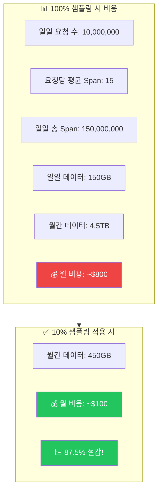
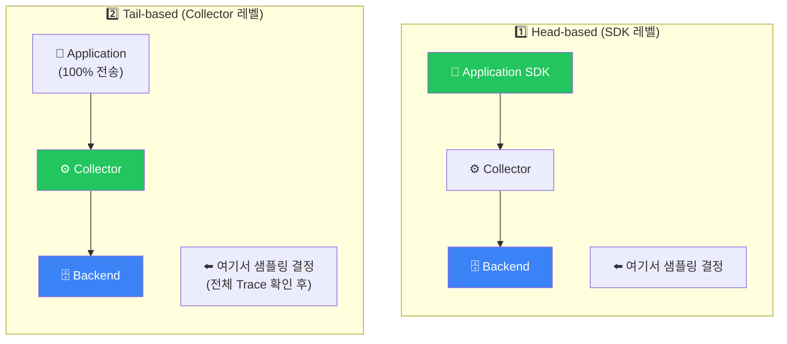
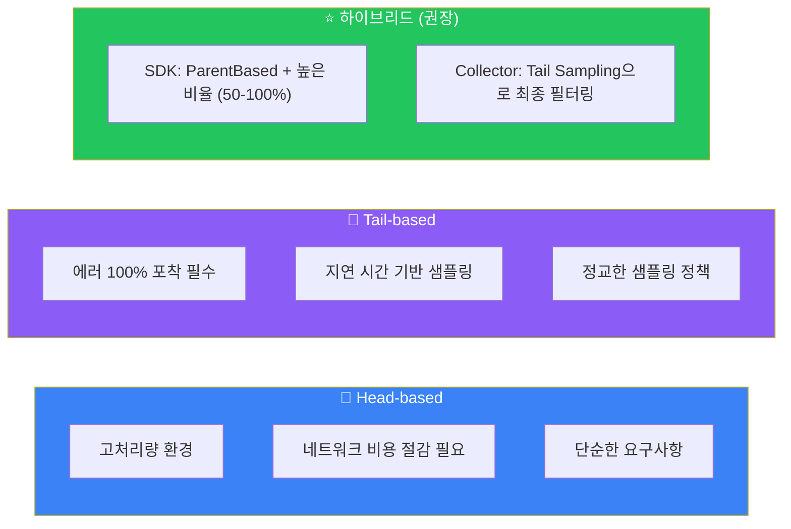

# 샘플링 전략

## 샘플링이 필요한 이유



> **핵심**: 중요한 트레이스는 100% 유지하면서 일반 트레이스만 샘플링

## 샘플링 위치



## Head-based Sampling

### 1. 항상 켜기 / 항상 끄기

```python
from opentelemetry.sdk.trace.sampling import ALWAYS_ON, ALWAYS_OFF

# 항상 샘플링 (개발 환경)
provider = TracerProvider(sampler=ALWAYS_ON)

# 항상 샘플링 안함 (특정 상황)
provider = TracerProvider(sampler=ALWAYS_OFF)
```

### 2. 확률 기반 샘플링

```python
from opentelemetry.sdk.trace.sampling import TraceIdRatioBased

# 10% 샘플링
sampler = TraceIdRatioBased(0.1)

provider = TracerProvider(sampler=sampler)
```

### 3. 부모 기반 샘플링 (권장)

```python
from opentelemetry.sdk.trace.sampling import (
    ParentBased,
    TraceIdRatioBased,
    ALWAYS_ON
)

# 부모가 있으면 부모의 결정을 따름
# 부모가 없으면 (root span) 10% 샘플링
sampler = ParentBased(
    root=TraceIdRatioBased(0.1),
    remote_parent_sampled=ALWAYS_ON,      # 원격 부모가 샘플링됨
    remote_parent_not_sampled=ALWAYS_OFF, # 원격 부모가 샘플링 안됨
    local_parent_sampled=ALWAYS_ON,       # 로컬 부모가 샘플링됨
    local_parent_not_sampled=ALWAYS_OFF,  # 로컬 부모가 샘플링 안됨
)

provider = TracerProvider(sampler=sampler)
```

### 4. 커스텀 샘플러

```python
from opentelemetry.sdk.trace.sampling import Sampler, SamplingResult, Decision

class CustomSampler(Sampler):
    def should_sample(
        self,
        parent_context,
        trace_id,
        name,
        kind,
        attributes,
        links
    ):
        # 에러는 항상 샘플링
        if attributes and attributes.get("error"):
            return SamplingResult(Decision.RECORD_AND_SAMPLE)

        # 특정 경로는 샘플링 안함
        path = attributes.get("http.target", "") if attributes else ""
        if path in ["/health", "/ready", "/metrics"]:
            return SamplingResult(Decision.DROP)

        # 나머지는 10% 샘플링
        if hash(str(trace_id)) % 100 < 10:
            return SamplingResult(Decision.RECORD_AND_SAMPLE)

        return SamplingResult(Decision.DROP)

    def get_description(self):
        return "CustomSampler"
```

### Java 샘플러 설정

```java
// Java Agent 환경 변수
// -Dotel.traces.sampler=parentbased_traceidratio
// -Dotel.traces.sampler.arg=0.1

// 프로그래밍 방식
Sampler sampler = ParentBased.builder(
    TraceIdRatioBasedSampler.create(0.1)
).build();

SdkTracerProvider tracerProvider = SdkTracerProvider.builder()
    .setSampler(sampler)
    .build();
```

## Tail-based Sampling

Collector에서 전체 Trace를 확인한 후 샘플링 결정:

```yaml
# otel-collector-config.yaml
processors:
  tail_sampling:
    # 샘플링 결정까지 대기 시간
    decision_wait: 10s
    # 메모리에 보관할 최대 trace 수
    num_traces: 100000
    # 예상 초당 새 trace 수
    expected_new_traces_per_sec: 1000

    policies:
      # 정책 1: 에러가 있는 trace는 100% 유지
      - name: error-traces
        type: status_code
        status_code:
          status_codes: [ERROR]

      # 정책 2: 느린 trace는 100% 유지
      - name: slow-traces
        type: latency
        latency:
          threshold_ms: 1000  # 1초 이상

      # 정책 3: 특정 서비스는 100% 유지
      - name: critical-services
        type: string_attribute
        string_attribute:
          key: service.name
          values:
            - payment-service
            - auth-service

      # 정책 4: 특정 HTTP 상태 코드
      - name: client-errors
        type: string_attribute
        string_attribute:
          key: http.status_code
          values: ["400", "401", "403", "404"]

      # 정책 5: 확률 기반 (다른 정책에 해당 안되는 경우)
      - name: probabilistic-sampling
        type: probabilistic
        probabilistic:
          sampling_percentage: 10

service:
  pipelines:
    traces:
      receivers: [otlp]
      processors: [tail_sampling, batch]
      exporters: [otlp]
```

### 복합 정책

```yaml
processors:
  tail_sampling:
    policies:
      # AND 조건: 느리고 에러인 경우
      - name: slow-and-error
        type: and
        and:
          and_sub_policy:
            - name: slow
              type: latency
              latency:
                threshold_ms: 500
            - name: error
              type: status_code
              status_code:
                status_codes: [ERROR]

      # OR 조건: 복합 정책
      - name: important-traces
        type: composite
        composite:
          max_total_spans_per_second: 1000
          policy_order: [error-policy, slow-policy, default-policy]
          composite_sub_policy:
            - name: error-policy
              type: status_code
              status_code:
                status_codes: [ERROR]
            - name: slow-policy
              type: latency
              latency:
                threshold_ms: 1000
            - name: default-policy
              type: probabilistic
              probabilistic:
                sampling_percentage: 5
          rate_allocation:
            - policy: error-policy
              percent: 50
            - policy: slow-policy
              percent: 30
            - policy: default-policy
              percent: 20
```

## 샘플링 전략 비교

| 특성 | Head-based | Tail-based |
|------|------------|------------|
| 결정 시점 | 요청 시작 시 | 전체 Trace 완료 후 |
| 네트워크 비용 | 낮음 ✅ | 높음 (100% 전송) |
| 결정 정확도 | 낮음 (예측 기반) | 높음 (사실 기반) ✅ |
| 에러 포착 | 일부 누락 가능 | 100% 포착 가능 ✅ |
| 지연 시간 기반 | 불가능 | 가능 ✅ |
| 구현 복잡도 | 낮음 ✅ | 높음 |
| 메모리 사용 | 낮음 ✅ | 높음 (버퍼링) |

### 권장 사용 케이스



## 프로덕션 권장 구성

### 환경별 설정

```yaml
# 개발 환경
development:
  sdk_sampling: ALWAYS_ON
  collector_sampling: none

# 스테이징 환경
staging:
  sdk_sampling: ParentBased(TraceIdRatioBased(0.5))
  collector_sampling: tail_sampling (basic)

# 프로덕션 환경
production:
  sdk_sampling: ParentBased(TraceIdRatioBased(0.2))
  collector_sampling: tail_sampling (comprehensive)
```

### 프로덕션 Collector 설정

```yaml
# production-collector-config.yaml
processors:
  # 메모리 보호
  memory_limiter:
    check_interval: 1s
    limit_mib: 4000
    spike_limit_mib: 800

  # Tail Sampling
  tail_sampling:
    decision_wait: 30s
    num_traces: 500000
    expected_new_traces_per_sec: 5000
    policies:
      # 1. 에러는 무조건 유지
      - name: errors
        type: status_code
        status_code:
          status_codes: [ERROR]

      # 2. 느린 요청 (p99 초과)
      - name: high-latency
        type: latency
        latency:
          threshold_ms: 2000

      # 3. 결제 관련 100%
      - name: payment
        type: string_attribute
        string_attribute:
          key: service.name
          values: [payment-service, billing-service]

      # 4. 특정 사용자 (디버깅용)
      - name: debug-users
        type: string_attribute
        string_attribute:
          key: user.id
          values: [debug-user-1, vip-customer]

      # 5. 나머지 5%
      - name: default
        type: probabilistic
        probabilistic:
          sampling_percentage: 5

  batch:
    timeout: 5s
    send_batch_size: 10000

service:
  pipelines:
    traces:
      receivers: [otlp]
      processors: [memory_limiter, tail_sampling, batch]
      exporters: [otlp/tempo]
```

## 샘플링 모니터링

### 샘플링률 메트릭

```yaml
# Collector 자체 메트릭
scrape_configs:
  - job_name: 'otel-collector'
    static_configs:
      - targets: ['collector:8888']
```

```promql
# 샘플링 비율 확인
rate(otelcol_processor_tail_sampling_count_traces_sampled[5m])
/
rate(otelcol_processor_tail_sampling_count_traces_evaluated[5m])

# 정책별 샘플링 수
sum by (policy) (
  rate(otelcol_processor_tail_sampling_sampling_decision_latency_count[5m])
)
```

## 다음 단계

- [프로덕션 배포](./production-deployment) - 프로덕션 환경 배포 가이드
- [성능 최적화](./performance-optimization) - 성능 튜닝
