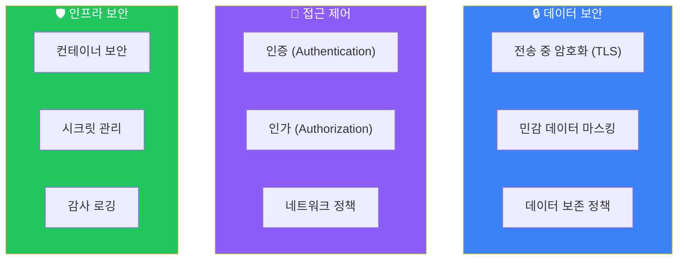

# 보안

## 보안 고려사항



## TLS 암호화

### 인증서 생성

```bash
# 자체 서명 인증서 생성 (테스트용)
# CA 키 및 인증서 생성
openssl genrsa -out ca.key 4096
openssl req -x509 -new -nodes -key ca.key -sha256 -days 365 -out ca.crt \
    -subj "/CN=OTel CA"

# 서버 키 및 CSR 생성
openssl genrsa -out server.key 2048
openssl req -new -key server.key -out server.csr \
    -subj "/CN=otel-collector.monitoring.svc.cluster.local"

# 서버 인증서 서명
openssl x509 -req -in server.csr -CA ca.crt -CAkey ca.key -CAcreateserial \
    -out server.crt -days 365 -sha256

# 클라이언트 키 및 인증서 (mTLS용)
openssl genrsa -out client.key 2048
openssl req -new -key client.key -out client.csr \
    -subj "/CN=otel-client"
openssl x509 -req -in client.csr -CA ca.crt -CAkey ca.key -CAcreateserial \
    -out client.crt -days 365 -sha256
```

### Collector TLS 설정

```yaml
# collector-config.yaml
receivers:
  otlp:
    protocols:
      grpc:
        endpoint: 0.0.0.0:4317
        tls:
          cert_file: /certs/server.crt
          key_file: /certs/server.key
          ca_file: /certs/ca.crt
          client_ca_file: /certs/ca.crt  # mTLS 필수
          min_version: "1.2"
          max_version: "1.3"
          cipher_suites:
            - TLS_ECDHE_RSA_WITH_AES_256_GCM_SHA384
            - TLS_ECDHE_RSA_WITH_AES_128_GCM_SHA256

      http:
        endpoint: 0.0.0.0:4318
        tls:
          cert_file: /certs/server.crt
          key_file: /certs/server.key
          ca_file: /certs/ca.crt

exporters:
  otlp:
    endpoint: tempo.monitoring:4317
    tls:
      cert_file: /certs/client.crt
      key_file: /certs/client.key
      ca_file: /certs/ca.crt
      insecure: false
```

### SDK TLS 설정

```python
# Python SDK
from opentelemetry.exporter.otlp.proto.grpc.trace_exporter import OTLPSpanExporter
import ssl

ssl_context = ssl.create_default_context(
    ssl.Purpose.SERVER_AUTH,
    cafile='/certs/ca.crt'
)
ssl_context.load_cert_chain(
    certfile='/certs/client.crt',
    keyfile='/certs/client.key'
)

exporter = OTLPSpanExporter(
    endpoint="https://collector.example.com:4317",
    credentials=ssl_channel_credentials(
        root_certificates=open('/certs/ca.crt', 'rb').read(),
        private_key=open('/certs/client.key', 'rb').read(),
        certificate_chain=open('/certs/client.crt', 'rb').read()
    )
)
```

```javascript
// Node.js SDK
const fs = require('fs');
const { OTLPTraceExporter } = require('@opentelemetry/exporter-trace-otlp-grpc');
const grpc = require('@grpc/grpc-js');

const credentials = grpc.credentials.createSsl(
  fs.readFileSync('/certs/ca.crt'),
  fs.readFileSync('/certs/client.key'),
  fs.readFileSync('/certs/client.crt')
);

const exporter = new OTLPTraceExporter({
  url: 'https://collector.example.com:4317',
  credentials,
});
```

## 인증 및 인가

### Bearer Token 인증

```yaml
# Collector 설정
extensions:
  bearertokenauth:
    token: ${AUTH_TOKEN}  # 환경 변수에서 로드

receivers:
  otlp:
    protocols:
      grpc:
        endpoint: 0.0.0.0:4317
        auth:
          authenticator: bearertokenauth

service:
  extensions: [bearertokenauth]
```

### OIDC 인증

```yaml
extensions:
  oidc:
    issuer_url: https://auth.example.com
    audience: otel-collector
    attribute: authorization

receivers:
  otlp:
    protocols:
      http:
        auth:
          authenticator: oidc
```

### 헤더 기반 인가

```yaml
# API 키 검증
processors:
  attributes:
    actions:
      - key: x-api-key
        action: delete  # 처리 후 제거

# 또는 외부 인가 서비스 사용
extensions:
  oauth2client:
    client_id: ${CLIENT_ID}
    client_secret: ${CLIENT_SECRET}
    token_url: https://auth.example.com/oauth/token
```

## 민감 데이터 처리

### 속성 필터링

```yaml
processors:
  attributes:
    actions:
      # 민감 헤더 삭제
      - key: http.request.header.authorization
        action: delete
      - key: http.request.header.cookie
        action: delete
      - key: http.request.header.x-api-key
        action: delete

      # 민감 정보 해시화
      - key: user.id
        action: hash
      - key: db.statement
        action: hash

      # 이메일 마스킹
      - key: user.email
        pattern: "^(?P<user>[^@]+)@(?P<domain>.+)$"
        action: extract
      - key: user.email
        action: delete

      # 신용카드 마스킹 (마지막 4자리만 유지)
      - key: payment.card_number
        pattern: "^.{12}(?P<last4>.{4})$"
        action: extract
      - key: payment.card_number
        value: "****-****-****-${last4}"
        action: update
```

### 정규식 기반 마스킹

```yaml
processors:
  redaction:
    allow_all_keys: false
    allowed_keys:
      - service.name
      - http.method
      - http.status_code
      - http.url
    blocked_values:
      # SSN 패턴
      - "\\d{3}-\\d{2}-\\d{4}"
      # 신용카드 패턴
      - "\\d{4}[- ]?\\d{4}[- ]?\\d{4}[- ]?\\d{4}"
      # API 키 패턴
      - "(?i)(api[_-]?key|apikey|secret)['\"]?\\s*[:=]\\s*['\"]?[a-zA-Z0-9]{16,}"
```

### Transform Processor 사용

```yaml
processors:
  transform:
    trace_statements:
      - context: span
        statements:
          # SQL에서 값 제거
          - replace_pattern(attributes["db.statement"], "= '[^']*'", "= '***'")
          - replace_pattern(attributes["db.statement"], "= \"[^\"]*\"", "= \"***\"")

          # URL 쿼리 파라미터 마스킹
          - replace_pattern(attributes["http.url"], "password=[^&]*", "password=***")
          - replace_pattern(attributes["http.url"], "token=[^&]*", "token=***")
```

## Kubernetes 보안

### NetworkPolicy

```yaml
# network-policy.yaml
apiVersion: networking.k8s.io/v1
kind: NetworkPolicy
metadata:
  name: otel-collector-network-policy
  namespace: monitoring
spec:
  podSelector:
    matchLabels:
      app: otel-collector
  policyTypes:
    - Ingress
    - Egress
  ingress:
    # 애플리케이션 네임스페이스에서만 수신 허용
    - from:
        - namespaceSelector:
            matchLabels:
              otel-enabled: "true"
      ports:
        - port: 4317
          protocol: TCP
        - port: 4318
          protocol: TCP
  egress:
    # Tempo로만 전송 허용
    - to:
        - podSelector:
            matchLabels:
              app: tempo
      ports:
        - port: 4317
          protocol: TCP
    # DNS 허용
    - to:
        - namespaceSelector: {}
          podSelector:
            matchLabels:
              k8s-app: kube-dns
      ports:
        - port: 53
          protocol: UDP
```

### RBAC 설정

```yaml
# rbac.yaml
apiVersion: v1
kind: ServiceAccount
metadata:
  name: otel-collector
  namespace: monitoring

---
apiVersion: rbac.authorization.k8s.io/v1
kind: ClusterRole
metadata:
  name: otel-collector
rules:
  # Pod 정보 조회 (k8sattributes processor용)
  - apiGroups: [""]
    resources: ["pods", "namespaces", "nodes"]
    verbs: ["get", "list", "watch"]
  # ReplicaSets 조회 (deployment 정보용)
  - apiGroups: ["apps"]
    resources: ["replicasets"]
    verbs: ["get", "list", "watch"]

---
apiVersion: rbac.authorization.k8s.io/v1
kind: ClusterRoleBinding
metadata:
  name: otel-collector
subjects:
  - kind: ServiceAccount
    name: otel-collector
    namespace: monitoring
roleRef:
  kind: ClusterRole
  name: otel-collector
  apiGroup: rbac.authorization.k8s.io
```

### Pod Security

```yaml
# secure-deployment.yaml
apiVersion: apps/v1
kind: Deployment
metadata:
  name: otel-collector
spec:
  template:
    spec:
      serviceAccountName: otel-collector
      securityContext:
        runAsNonRoot: true
        runAsUser: 10001
        fsGroup: 10001
        seccompProfile:
          type: RuntimeDefault
      containers:
        - name: otel-collector
          image: otel/opentelemetry-collector-contrib:0.91.0
          securityContext:
            allowPrivilegeEscalation: false
            readOnlyRootFilesystem: true
            capabilities:
              drop:
                - ALL
          volumeMounts:
            - name: config
              mountPath: /etc/otel
              readOnly: true
            - name: certs
              mountPath: /certs
              readOnly: true
            - name: tmp
              mountPath: /tmp
```

## 시크릿 관리

### Kubernetes Secrets

```yaml
# secrets.yaml
apiVersion: v1
kind: Secret
metadata:
  name: otel-collector-secrets
  namespace: monitoring
type: Opaque
stringData:
  auth-token: "your-auth-token"

---
# deployment에서 사용
env:
  - name: AUTH_TOKEN
    valueFrom:
      secretKeyRef:
        name: otel-collector-secrets
        key: auth-token
```

### Vault 연동

```yaml
# Vault Agent Injector 사용
apiVersion: apps/v1
kind: Deployment
metadata:
  name: otel-collector
spec:
  template:
    metadata:
      annotations:
        vault.hashicorp.com/agent-inject: "true"
        vault.hashicorp.com/role: "otel-collector"
        vault.hashicorp.com/agent-inject-secret-certs: "secret/data/otel/certs"
        vault.hashicorp.com/agent-inject-template-certs: |
          {{- with secret "secret/data/otel/certs" -}}
          {{ .Data.data.ca_crt }}
          {{- end }}
```

## 감사 로깅

### Collector 로그 설정

```yaml
service:
  telemetry:
    logs:
      level: info
      output_paths: ["stdout", "/var/log/otel/collector.log"]
      error_output_paths: ["stderr"]
      encoding: json
      initial_fields:
        service: otel-collector
```

### 접근 로깅

```yaml
# 모든 요청 로깅
extensions:
  zpages:
    endpoint: localhost:55679  # 내부만 접근

processors:
  # 접근 로그용 속성 추가
  attributes:
    actions:
      - key: audit.timestamp
        value: ${timestamp}
        action: insert
      - key: audit.source_ip
        from_context: client.address
        action: insert
```

## 보안 체크리스트

### 전송 보안
- [ ] TLS 1.2+ 적용
- [ ] mTLS 적용 (선택)
- [ ] 강력한 암호화 스위트
- [ ] 인증서 자동 갱신

### 인증/인가
- [ ] Bearer Token 또는 OIDC 인증
- [ ] 최소 권한 원칙
- [ ] API 키 주기적 로테이션

### 데이터 보호
- [ ] 민감 데이터 필터링
- [ ] PII 마스킹
- [ ] SQL 파라미터 제거
- [ ] 데이터 보존 정책

### 인프라 보안
- [ ] NetworkPolicy 적용
- [ ] RBAC 최소 권한
- [ ] Pod Security Standards
- [ ] 시크릿 관리
- [ ] 이미지 취약점 스캔

### 운영 보안
- [ ] 감사 로깅
- [ ] 접근 모니터링
- [ ] 보안 알림 설정

## 다음 단계

- [트러블슈팅](./troubleshooting) - 문제 해결 가이드
- [실습](../practical/docker-compose-setup) - 실습 예제
