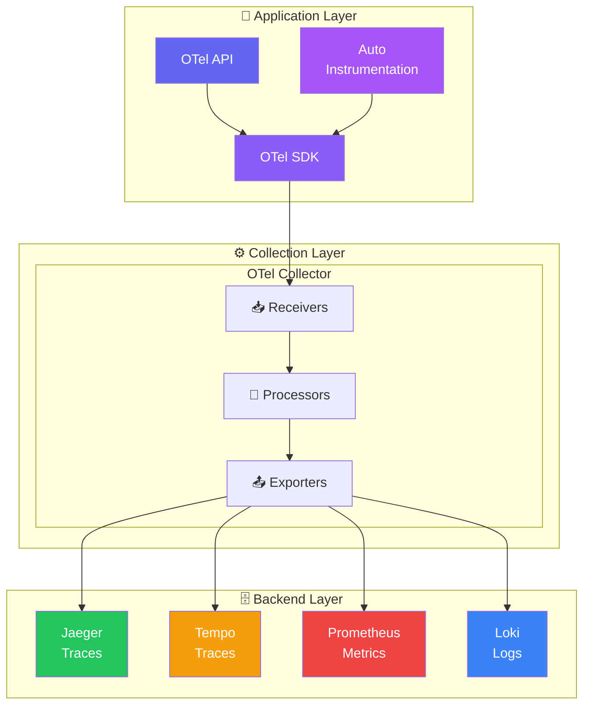
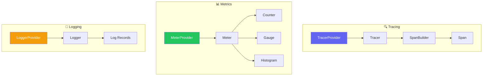

# OpenTelemetry 아키텍처

## 전체 아키텍처 개요

OpenTelemetry는 크게 세 가지 계층으로 구성됩니다:



## 구성 요소 상세

### 1. OTel API

**목적**: 계측(Instrumentation)을 위한 인터페이스 정의



**특징**:
- 최소한의 의존성
- No-op 구현 제공 (SDK 없이도 동작)
- 언어별로 관용적인 API 설계

### 2. OTel SDK

**목적**: API의 실제 구현 제공

```python
# SDK 설정 예시 (Python)
from opentelemetry import trace
from opentelemetry.sdk.trace import TracerProvider
from opentelemetry.sdk.trace.export import BatchSpanProcessor
from opentelemetry.exporter.otlp.proto.grpc.trace_exporter import OTLPSpanExporter

# Provider 설정
provider = TracerProvider()

# Processor와 Exporter 설정
processor = BatchSpanProcessor(
    OTLPSpanExporter(endpoint="http://collector:4317")
)
provider.add_span_processor(processor)

# 전역 Provider로 설정
trace.set_tracer_provider(provider)
```

**SDK 구성 요소**:

| 구성 요소 | 역할 |
|-----------|------|
| **TracerProvider** | Tracer 인스턴스 생성 및 관리 |
| **SpanProcessor** | Span 처리 파이프라인 |
| **SpanExporter** | Span 데이터 내보내기 |
| **Sampler** | 샘플링 전략 적용 |
| **Resource** | 리소스 정보 관리 |

### 3. Auto-Instrumentation (자동 계측)

**목적**: 코드 변경 없이 자동으로 텔레메트리 수집

```
┌─────────────────────────────────────────────────────────────┐
│                    Auto-Instrumentation                      │
├─────────────────────────────────────────────────────────────┤
│                                                              │
│  방식 1: Agent (Java, Python, Node.js)                      │
│  ┌─────────────────────────────────────────────────────┐   │
│  │  $ java -javaagent:opentelemetry-javaagent.jar \    │   │
│  │         -jar myapp.jar                               │   │
│  │                                                      │   │
│  │  JVM 바이트코드 조작으로 자동 계측                    │   │
│  └─────────────────────────────────────────────────────┘   │
│                                                              │
│  방식 2: Instrumentation Libraries                          │
│  ┌─────────────────────────────────────────────────────┐   │
│  │  # pip install opentelemetry-instrumentation-flask  │   │
│  │  from opentelemetry.instrumentation.flask import    │   │
│  │      FlaskInstrumentor                              │   │
│  │  FlaskInstrumentor().instrument()                   │   │
│  └─────────────────────────────────────────────────────┘   │
│                                                              │
└─────────────────────────────────────────────────────────────┘
```

**지원하는 라이브러리/프레임워크 예시**:

| 언어 | HTTP | 데이터베이스 | 메시징 |
|------|------|-------------|--------|
| Java | Spring, JAX-RS | JDBC, Hibernate | Kafka, RabbitMQ |
| Python | Flask, Django, FastAPI | SQLAlchemy, psycopg2 | kafka-python |
| Node.js | Express, Fastify | pg, mysql2 | kafkajs |
| Go | net/http, gin | database/sql | sarama |

## OTel Collector 아키텍처

Collector는 OpenTelemetry의 핵심 컴포넌트입니다:

```
┌─────────────────────────────────────────────────────────────────┐
│                       OTel Collector                             │
├─────────────────────────────────────────────────────────────────┤
│                                                                  │
│  ┌─────────────────────────────────────────────────────────┐   │
│  │                      Receivers                           │   │
│  │  ┌─────────┐ ┌─────────┐ ┌─────────┐ ┌─────────┐       │   │
│  │  │  OTLP   │ │ Jaeger  │ │  Zipkin │ │Prometheus│       │   │
│  │  │ (gRPC/  │ │         │ │         │ │         │       │   │
│  │  │  HTTP)  │ │         │ │         │ │         │       │   │
│  │  └────┬────┘ └────┬────┘ └────┬────┘ └────┬────┘       │   │
│  └───────┼───────────┼───────────┼───────────┼─────────────┘   │
│          └───────────┴───────────┴───────────┘                  │
│                              │                                   │
│                              ▼                                   │
│  ┌─────────────────────────────────────────────────────────┐   │
│  │                      Processors                          │   │
│  │  ┌─────────┐ ┌─────────┐ ┌─────────┐ ┌─────────┐       │   │
│  │  │  Batch  │ │ Memory  │ │Attribute│ │ Filter  │       │   │
│  │  │         │ │ Limiter │ │         │ │         │       │   │
│  │  └────┬────┘ └────┬────┘ └────┬────┘ └────┬────┘       │   │
│  └───────┼───────────┼───────────┼───────────┼─────────────┘   │
│          └───────────┴───────────┴───────────┘                  │
│                              │                                   │
│                              ▼                                   │
│  ┌─────────────────────────────────────────────────────────┐   │
│  │                      Exporters                           │   │
│  │  ┌─────────┐ ┌─────────┐ ┌─────────┐ ┌─────────┐       │   │
│  │  │  OTLP   │ │ Jaeger  │ │Prometheus│ │  Loki   │       │   │
│  │  └─────────┘ └─────────┘ └─────────┘ └─────────┘       │   │
│  └─────────────────────────────────────────────────────────┘   │
│                                                                  │
└─────────────────────────────────────────────────────────────────┘
```

### Receiver (수신기)

외부 소스에서 텔레메트리 데이터 수신:

```yaml
# collector-config.yaml
receivers:
  otlp:
    protocols:
      grpc:
        endpoint: 0.0.0.0:4317
      http:
        endpoint: 0.0.0.0:4318

  jaeger:
    protocols:
      thrift_http:
        endpoint: 0.0.0.0:14268

  prometheus:
    config:
      scrape_configs:
        - job_name: 'my-app'
          static_configs:
            - targets: ['localhost:8080']
```

### Processor (처리기)

데이터 변환, 필터링, 배치 처리:

```yaml
processors:
  # 배치 처리 (성능 최적화)
  batch:
    timeout: 5s
    send_batch_size: 1000

  # 메모리 제한 (안정성)
  memory_limiter:
    check_interval: 1s
    limit_mib: 1000

  # 속성 수정
  attributes:
    actions:
      - key: environment
        value: production
        action: insert

  # 불필요한 데이터 필터링
  filter:
    traces:
      span:
        - 'attributes["http.target"] == "/health"'
```

### Exporter (내보내기)

처리된 데이터를 백엔드로 전송:

```yaml
exporters:
  # OTLP 프로토콜로 전송
  otlp:
    endpoint: tempo:4317
    tls:
      insecure: true

  # Jaeger로 전송
  jaeger:
    endpoint: jaeger:14250
    tls:
      insecure: true

  # Prometheus 메트릭 노출
  prometheus:
    endpoint: 0.0.0.0:8889

  # 디버그용 콘솔 출력
  logging:
    verbosity: detailed
```

## 배포 패턴

### 패턴 1: Agent 모드

각 서버/Pod에 Collector를 사이드카로 배포:

```
┌──────────────────────────────────────────────────────────────┐
│                          Node/Pod                             │
│  ┌────────────────┐        ┌─────────────────────────────┐   │
│  │  Application   │ ────▶  │  OTel Collector (Agent)     │   │
│  │                │  OTLP  │  localhost:4317             │   │
│  └────────────────┘        └──────────────┬──────────────┘   │
│                                           │                   │
└───────────────────────────────────────────┼───────────────────┘
                                            │
                                            ▼
                              ┌─────────────────────────────┐
                              │  Central Collector/Backend  │
                              └─────────────────────────────┘
```

**장점**: 낮은 네트워크 지연, 애플리케이션과 독립적 설정
**단점**: 리소스 오버헤드

### 패턴 2: Gateway 모드

중앙 집중식 Collector 배포:

```
┌────────────────┐     ┌────────────────┐     ┌────────────────┐
│  Application   │     │  Application   │     │  Application   │
│       1        │     │       2        │     │       3        │
└───────┬────────┘     └───────┬────────┘     └───────┬────────┘
        │                      │                      │
        └──────────────────────┼──────────────────────┘
                               │
                               ▼
                 ┌─────────────────────────────┐
                 │     OTel Collector          │
                 │      (Gateway)              │
                 └──────────────┬──────────────┘
                                │
        ┌───────────────────────┼───────────────────────┐
        ▼                       ▼                       ▼
  ┌──────────┐           ┌──────────┐           ┌──────────┐
  │  Jaeger  │           │  Tempo   │           │Prometheus│
  └──────────┘           └──────────┘           └──────────┘
```

**장점**: 중앙 집중식 관리, 리소스 효율성
**단점**: 단일 장애점, 네트워크 지연

### 패턴 3: 하이브리드 모드 (권장)

Agent + Gateway 조합:

```
┌─────────────────────────────────────────────────────────────────┐
│                         Kubernetes Cluster                       │
├─────────────────────────────────────────────────────────────────┤
│                                                                  │
│  ┌─────────────────────┐    ┌─────────────────────┐            │
│  │       Pod 1         │    │       Pod 2         │            │
│  │ ┌─────┐  ┌───────┐ │    │ ┌─────┐  ┌───────┐ │            │
│  │ │ App │─▶│ Agent │ │    │ │ App │─▶│ Agent │ │            │
│  │ └─────┘  └───┬───┘ │    │ └─────┘  └───┬───┘ │            │
│  └──────────────┼─────┘    └──────────────┼─────┘            │
│                 │                          │                    │
│                 └────────────┬─────────────┘                   │
│                              │                                  │
│                              ▼                                  │
│                 ┌─────────────────────────────┐                │
│                 │   OTel Collector Gateway    │                │
│                 │   (Deployment/StatefulSet)  │                │
│                 └──────────────┬──────────────┘                │
│                                │                                │
└────────────────────────────────┼────────────────────────────────┘
                                 │
                                 ▼
                     ┌─────────────────────┐
                     │   Backend Systems   │
                     │  (Jaeger, Tempo)    │
                     └─────────────────────┘
```

## 데이터 흐름 요약

```
┌─────────────────────────────────────────────────────────────────┐
│                     Complete Data Flow                           │
├─────────────────────────────────────────────────────────────────┤
│                                                                  │
│  1. 계측                                                         │
│     Application → API → SDK → Span 생성                         │
│                                                                  │
│  2. 처리                                                         │
│     SDK SpanProcessor → Sampling → Batching                     │
│                                                                  │
│  3. 내보내기                                                      │
│     SDK Exporter → OTLP Protocol → Collector                    │
│                                                                  │
│  4. 수집                                                         │
│     Collector Receiver → Internal Format                        │
│                                                                  │
│  5. 가공                                                         │
│     Collector Processors → Filter, Enrich, Batch                │
│                                                                  │
│  6. 저장                                                         │
│     Collector Exporters → Backend (Jaeger, Tempo, etc.)         │
│                                                                  │
│  7. 시각화                                                        │
│     Backend → UI → 사용자                                        │
│                                                                  │
└─────────────────────────────────────────────────────────────────┘
```

## 다음 단계

- [시그널](./signals) - Traces, Metrics, Logs 상세 학습
- [시작하기](./getting-started) - 첫 번째 OTel 애플리케이션
