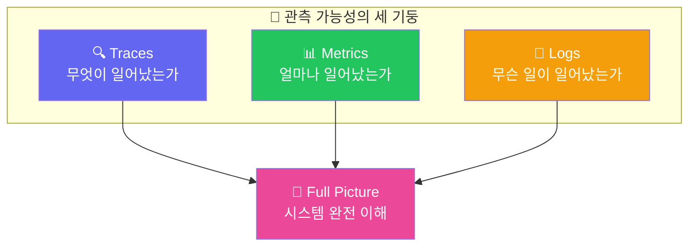
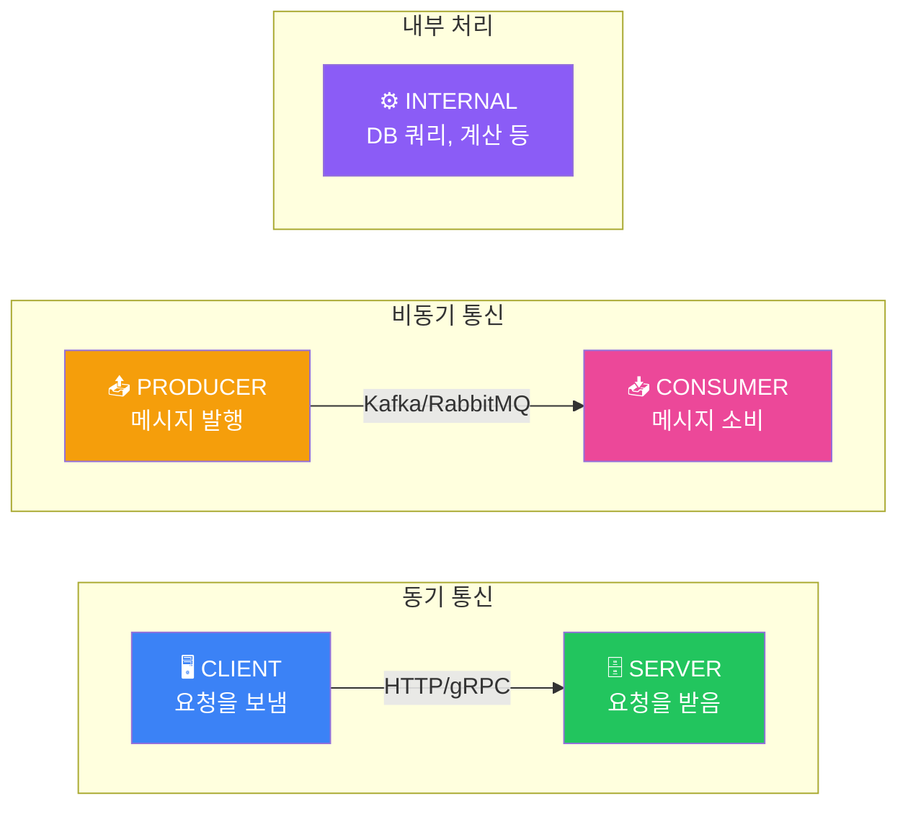
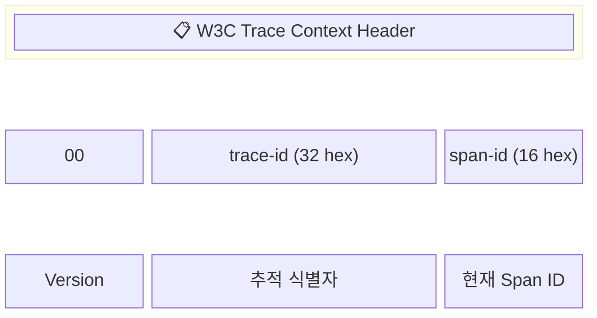
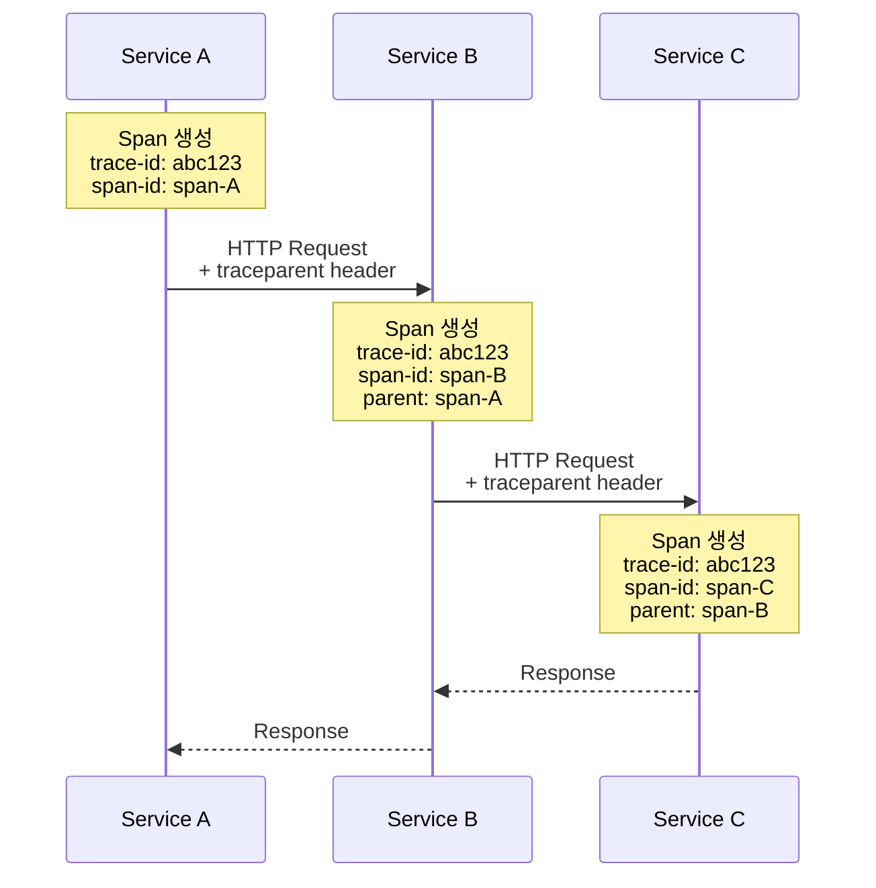
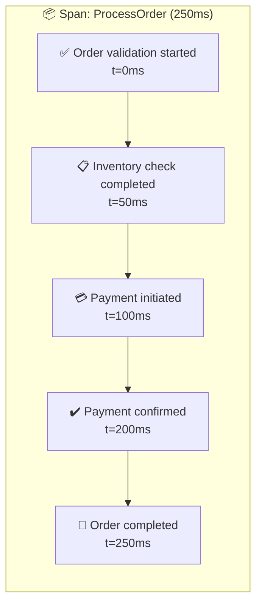
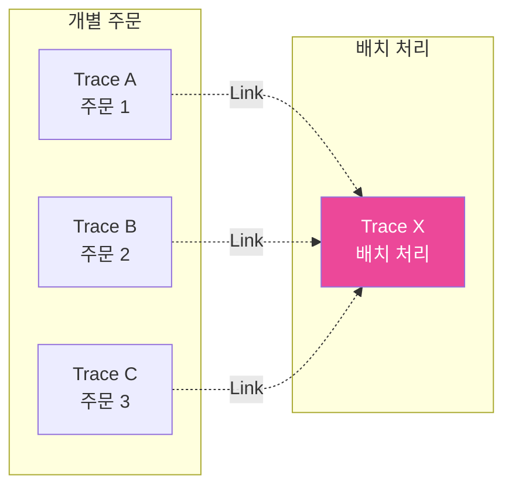

# OpenTelemetry 핵심 개념

## 관측 가능성(Observability)이란?

**관측 가능성**은 시스템의 외부 출력을 관찰하여 내부 상태를 이해할 수 있는 능력입니다.



## 분산 추적(Distributed Tracing) 개념

### Trace란?

**Trace**는 분산 시스템에서 하나의 요청이 여러 서비스를 거치는 전체 여정을 나타냅니다.

```mermaid
gantt
    title Trace ID: abc123
    dateFormat X
    axisFormat %L ms

    section Gateway
    HTTP GET /api/orders :a1, 0, 150

    section User Service
    GetUser            :a2, 10, 40

    section Order Service
    FetchOrders        :a3, 50, 130
    DB Query           :a4, 60, 105
    Cache Lookup       :a5, 110, 115
```



### Span이란?

**Span**은 Trace 내의 개별 작업 단위입니다. 각 Span은:

| 속성 | 설명 | 예시 |
|------|------|------|
| **Name** | 작업 이름 | `HTTP GET /api/users` |
| **Trace ID** | 전체 추적 식별자 | `abc123def456...` |
| **Span ID** | 개별 Span 식별자 | `span789...` |
| **Parent Span ID** | 부모 Span (선택) | `parentspan123...` |
| **Start Time** | 시작 시간 | `2024-01-15T10:30:00Z` |
| **Duration** | 소요 시간 | `150ms` |
| **Status** | 상태 | `OK`, `ERROR` |
| **Attributes** | 추가 메타데이터 | `http.method=GET` |

### Span의 구조

```python
# Span의 개념적 구조
span = {
    "trace_id": "abc123def456789",
    "span_id": "span001",
    "parent_span_id": None,  # Root Span은 부모가 없음
    "name": "HTTP GET /api/orders",
    "kind": "SERVER",
    "start_time": "2024-01-15T10:30:00.000Z",
    "end_time": "2024-01-15T10:30:00.150Z",
    "status": {
        "code": "OK"
    },
    "attributes": {
        "http.method": "GET",
        "http.url": "/api/orders",
        "http.status_code": 200,
        "user.id": "user123"
    },
    "events": [
        {
            "name": "cache.miss",
            "timestamp": "2024-01-15T10:30:00.050Z",
            "attributes": {"cache.key": "orders:user123"}
        }
    ],
    "links": []  # 다른 Trace와의 연결
}
```

## Span의 종류 (Span Kind)



| Kind | 설명 | 사용 예 |
|------|------|---------|
| **CLIENT** | 외부 서비스로 요청을 보내는 측 | HTTP 클라이언트, gRPC 클라이언트 |
| **SERVER** | 외부로부터 요청을 받는 측 | HTTP 서버, gRPC 서버 |
| **PRODUCER** | 비동기 메시지를 보내는 측 | Kafka Producer, RabbitMQ Publisher |
| **CONSUMER** | 비동기 메시지를 받는 측 | Kafka Consumer, RabbitMQ Subscriber |
| **INTERNAL** | 내부 작업 | 함수 호출, 로컬 처리 |

## Context Propagation

**Context Propagation**은 Trace 정보를 서비스 간에 전달하는 메커니즘입니다.

### W3C Trace Context



**예시:**
```
traceparent: 00-4bf92f3577b34da6a3ce929d0e0e4736-00f067aa0ba902b7-01
tracestate: congo=t61rcWkgMzE,rojo=00f067aa0ba902b7
```

### Propagation 흐름



> **Trace ID**: abc123 (모든 서비스에서 동일)
> **Span IDs**: span-A → span-B → span-C (각각 다름)

## Attributes와 Resources

### Span Attributes

Span에 추가 컨텍스트를 제공하는 키-값 쌍:

```yaml
# Semantic Conventions (의미적 규약)
http.method: "GET"
http.url: "https://api.example.com/users"
http.status_code: 200
http.request_content_length: 1024

db.system: "postgresql"
db.statement: "SELECT * FROM users WHERE id = ?"
db.operation: "SELECT"

messaging.system: "kafka"
messaging.destination: "orders-topic"
messaging.message_id: "msg-123"
```

### Resources

애플리케이션이나 인프라 수준의 메타데이터:

```yaml
# Resource Attributes
service.name: "order-service"
service.version: "1.2.3"
service.namespace: "production"

host.name: "server-01"
host.type: "n1-standard-4"

cloud.provider: "gcp"
cloud.region: "asia-northeast3"

k8s.pod.name: "order-service-7d8f9c6b5-x9k2m"
k8s.namespace.name: "default"
```

## Events와 Links

### Span Events

Span 수명 동안 발생하는 특정 이벤트:



### Span Links

관련된 다른 Trace나 Span과의 연결:



> Link를 통해 원본 주문들과 배치 처리 추적 연결

## 시각화 예시

### Jaeger UI에서의 Trace 뷰

```mermaid
gantt
    title Trace: HTTP GET /api/checkout (523ms)
    dateFormat X
    axisFormat %L ms

    section gateway-service
    HTTP GET /api/checkout      :a1, 0, 523

    section user-service
    GetUserProfile              :a2, 20, 176

    section user-db
    SELECT                      :a3, 50, 95

    section order-service
    CreateOrder                 :a4, 180, 492

    section payment-service
    ProcessPayment              :a5, 220, 409

    section payment-gateway
    Charge                      :a6, 280, 358
```



## 핵심 개념 요약

| 개념 | 설명 | 비유 |
|------|------|------|
| **Trace** | 전체 요청의 여정 | 택배 배송 전체 과정 |
| **Span** | 개별 작업 단위 | 택배의 각 배송 구간 |
| **Context** | Trace/Span 식별 정보 | 택배 송장 번호 |
| **Propagation** | 서비스 간 Context 전달 | 송장 번호 인계 |
| **Attributes** | 추가 메타데이터 | 택배 상세 정보 |
| **Resource** | 인프라 메타데이터 | 물류 센터 정보 |

## 다음 단계

핵심 개념을 이해했다면, 다음으로:
- [아키텍처](./architecture) - OTel 구성 요소 이해하기
- [시그널](./signals) - Traces, Metrics, Logs 상세 학습
