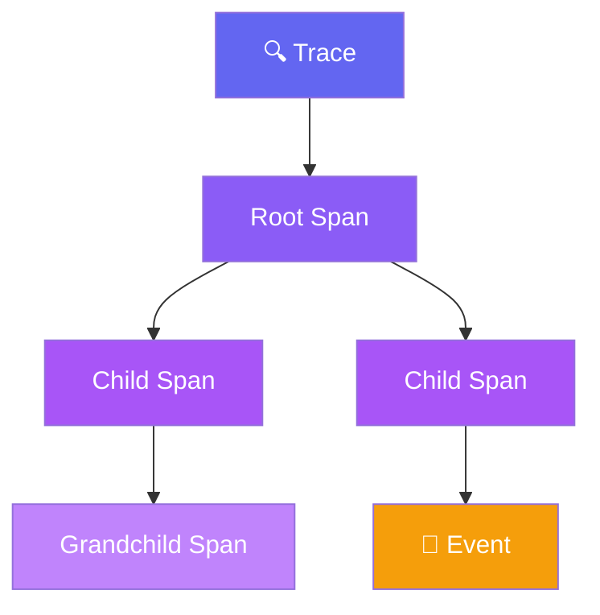
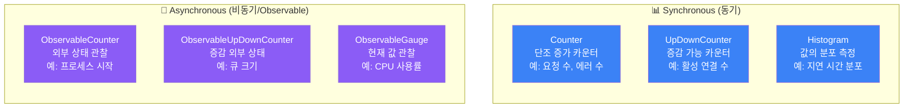
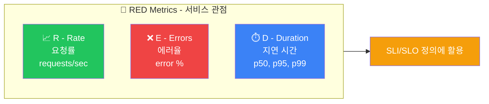
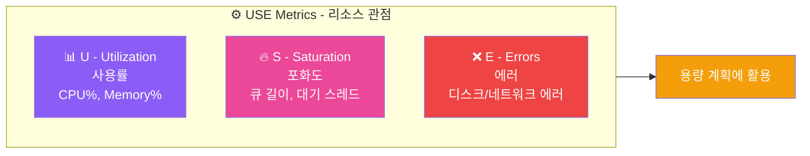
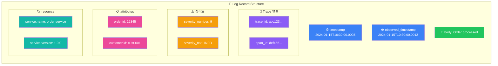
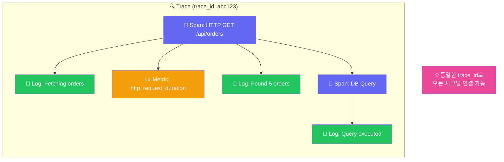
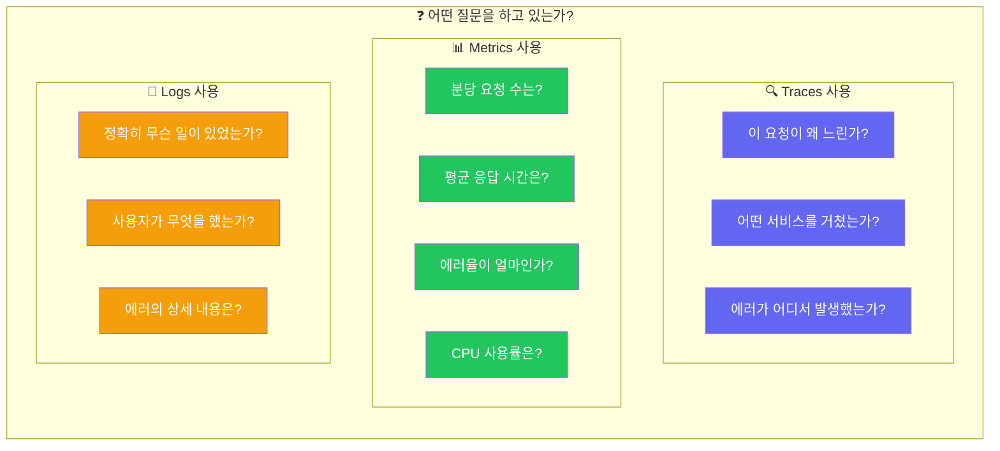

# OpenTelemetry 시그널

OpenTelemetry는 세 가지 핵심 시그널을 제공합니다: **Traces**, **Metrics**, **Logs**


## 1. Traces (분산 추적)

### 용도
- 요청의 전체 여정 추적
- 서비스 간 호출 관계 파악
- 지연 시간 분석 및 병목 식별

### 구성 요소



### 코드 예시

```python
from opentelemetry import trace

tracer = trace.get_tracer(__name__)

# 기본 Span 생성
with tracer.start_as_current_span("process-order") as span:
    # 속성 추가
    span.set_attribute("order.id", "12345")
    span.set_attribute("customer.id", "cust-001")

    # 중첩 Span
    with tracer.start_as_current_span("validate-order"):
        validate_order()

    with tracer.start_as_current_span("process-payment"):
        # 이벤트 기록
        span.add_event("payment_started", {
            "payment.method": "credit_card"
        })
        process_payment()
        span.add_event("payment_completed")

    # 상태 설정
    span.set_status(trace.Status(trace.StatusCode.OK))
```

### Span 상태 코드

| 상태 | 설명 |
|------|------|
| `UNSET` | 기본값, 상태 미설정 |
| `OK` | 작업 성공 |
| `ERROR` | 작업 실패 |

## 2. Metrics (메트릭)

### 용도
- 시스템/비즈니스 지표 측정
- 시계열 데이터 수집
- 알림 및 대시보드 구성

### Instrument 타입



### 코드 예시

```python
from opentelemetry import metrics

meter = metrics.get_meter(__name__)

# Counter - 단조 증가
request_counter = meter.create_counter(
    name="http_requests_total",
    description="Total HTTP requests",
    unit="1"
)

# 사용
request_counter.add(1, {"method": "GET", "path": "/api/users"})

# Histogram - 분포 측정
latency_histogram = meter.create_histogram(
    name="http_request_duration_seconds",
    description="HTTP request latency",
    unit="s"
)

# 사용
latency_histogram.record(0.125, {"method": "GET", "status": "200"})

# UpDownCounter - 증감 가능
active_connections = meter.create_up_down_counter(
    name="active_connections",
    description="Number of active connections"
)

# 사용
active_connections.add(1)   # 연결 추가
active_connections.add(-1)  # 연결 종료

# Observable Gauge - 비동기 관찰
def get_cpu_usage(options):
    yield metrics.Observation(
        value=get_current_cpu(),
        attributes={"cpu": "0"}
    )

meter.create_observable_gauge(
    name="system_cpu_usage",
    callbacks=[get_cpu_usage],
    description="Current CPU usage"
)
```

### 일반적인 메트릭 패턴

#### RED 메트릭 (Request-focused)



#### USE 메트릭 (Resource-focused)



## 3. Logs (로그)

### 용도
- 상세한 이벤트 기록
- 디버깅 및 감사
- Trace와 연결된 컨텍스트 로깅

### OTel Logs 데이터 모델



### 심각도 레벨

| 숫자 | 텍스트 | 설명 |
|------|--------|------|
| 1-4 | TRACE | 매우 상세한 디버그 정보 |
| 5-8 | DEBUG | 디버그 정보 |
| 9-12 | INFO | 정보성 메시지 |
| 13-16 | WARN | 경고 |
| 17-20 | ERROR | 에러 |
| 21-24 | FATAL | 치명적 에러 |

### 코드 예시

```python
import logging
from opentelemetry import trace
from opentelemetry._logs import set_logger_provider
from opentelemetry.sdk._logs import LoggerProvider, LoggingHandler
from opentelemetry.sdk._logs.export import BatchLogRecordProcessor
from opentelemetry.exporter.otlp.proto.grpc._log_exporter import OTLPLogExporter

# OTel Logs 설정
logger_provider = LoggerProvider()
logger_provider.add_log_record_processor(
    BatchLogRecordProcessor(OTLPLogExporter())
)
set_logger_provider(logger_provider)

# Python logging과 연동
handler = LoggingHandler(logger_provider=logger_provider)
logging.getLogger().addHandler(handler)

# 사용
logger = logging.getLogger(__name__)

# Trace 컨텍스트 내에서 로깅
tracer = trace.get_tracer(__name__)
with tracer.start_as_current_span("process-order"):
    logger.info("Processing order", extra={
        "order.id": "12345",
        "customer.id": "cust-001"
    })
    # 로그에 자동으로 trace_id, span_id 포함됨
```

## 시그널 간 상관관계 (Correlation)

### Trace ID를 통한 연결



### Exemplars (메트릭-트레이스 연결)

```yaml
# Histogram 메트릭에 Trace 샘플 첨부
http_request_duration_bucket{le="0.5"} 100
http_request_duration_bucket{le="1.0"} 150

# Exemplar
http_request_duration_bucket{le="1.0"} 150 # {trace_id="abc123"} 0.85

# 느린 요청의 구체적인 Trace 확인 가능
```

## 시그널 선택 가이드



## 다음 단계

시그널을 이해했다면:
- [시작하기](./getting-started) - 실제 코드로 시그널 생성
- [계측](../intermediate/instrumentation) - 다양한 계측 방법 학습
