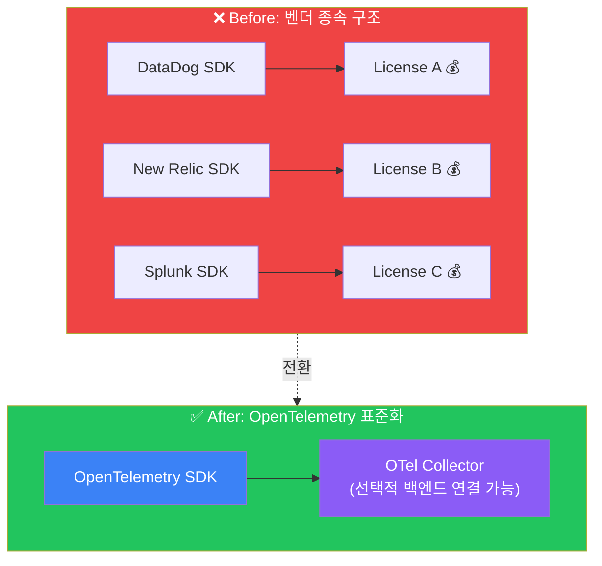
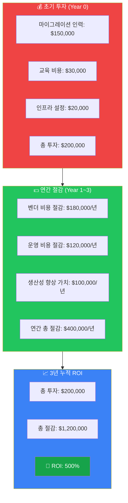
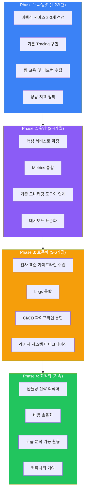

# OpenTelemetry ROI 분석 및 도입 전략

OpenTelemetry 도입은 단순한 기술 변경이 아닌 **비즈니스 가치 창출**입니다. 이 문서에서는 실제 기업들의 데이터를 바탕으로 ROI를 분석하고 효과적인 도입 전략을 제시합니다.

## 💰 ROI 분석 프레임워크

### 비용 절감 영역

#### 1. 벤더 비용 절감



**절감 효과:**
- 멀티 벤더 라이선스 비용 → 단일 표준화된 수집
- 벤더 전환 비용 최소화 (락인 해소)
- 협상력 향상으로 계약 비용 절감

#### 2. 인프라 비용 절감

| 항목 | 기존 방식 | OpenTelemetry | 절감률 |
|------|----------|---------------|--------|
| 에이전트 메모리 | 노드당 50MB+ | 노드당 20MB | **60%** |
| 데이터 전송량 | 100% 전송 | 샘플링 적용 | **70-90%** |
| 스토리지 비용 | 전체 저장 | 지능적 필터링 | **40-60%** |
| 백엔드 처리 | 벤더별 중복 | 통합 파이프라인 | **50%+** |

#### 3. 운영 비용 절감

```yaml
# 비용 절감 계산 예시 (1000 서비스 기준)
cost_analysis:
  before_otel:
    mttr_hours: 4
    incidents_per_month: 50
    engineer_hourly_rate: $100
    monthly_incident_cost: $20,000

  after_otel:
    mttr_hours: 1.5  # 62.5% 감소
    incidents_per_month: 35  # 30% 감소 (조기 탐지)
    engineer_hourly_rate: $100
    monthly_incident_cost: $5,250

  monthly_savings: $14,750
  annual_savings: $177,000
```

### 생산성 향상 영역

#### 1. 개발자 생산성

| 활동 | 기존 소요 시간 | OTel 적용 후 | 개선율 |
|------|---------------|--------------|--------|
| 신규 서비스 계측 | 2-3일 | 2-4시간 | **85%** |
| 문제 원인 분석 | 4-8시간 | 30분-1시간 | **87%** |
| 관측성 도구 학습 | 벤더별 2주 | 1회 3일 | **79%** |
| 크로스팀 협업 | 컨텍스트 공유 어려움 | 통합 뷰 제공 | **70%+** |

#### 2. 비즈니스 민첩성

| 지표 | 개선율 | 효과 |
|------|--------|------|
| 배포 주기 | **73%** | 주간 → 일간 배포 가능 |
| 새로운 백엔드 통합 | **90%** | 수주 → 수일 |
| 멀티클라우드 전환 | **65%** | 관측성 재구축 불필요 |

---

## 📊 실제 ROI 사례

### Case 1: 중견 기업 (서비스 100개, 엔지니어 50명)



### Case 2: 대기업 (서비스 1000개, 엔지니어 500명)

| 구분 | Year 0 | Year 1 | Year 2 | Year 3 |
|------|--------|--------|--------|--------|
| 투자 비용 | $800K | $100K | $50K | $50K |
| 벤더 절감 | - | $1.2M | $1.5M | $1.8M |
| 운영 절감 | - | $600K | $800K | $1M |
| 생산성 | - | $400K | $600K | $800K |
| **연간 순이익** | -$800K | $2.1M | $2.85M | $3.55M |
| **누적 ROI** | - | 163% | 419% | 693% |

---

## 🎯 도입 전략

### 단계별 접근법



### 빠른 승리 (Quick Wins) 전략

#### Week 1-2: 즉각적 가치 증명

```javascript
// 1. Auto-instrumentation으로 즉시 시작
// Node.js 예시
require('@opentelemetry/auto-instrumentations-node').register();

// 이것만으로 HTTP, DB, 메시지큐 자동 추적!
```

#### Week 3-4: 핵심 비즈니스 트랜잭션 추적

```java
// 2. 중요 비즈니스 로직에 커스텀 스팬 추가
@WithSpan("processPayment")
public PaymentResult processPayment(
    @SpanAttribute("order.id") String orderId,
    @SpanAttribute("payment.amount") double amount) {
    // 결제 처리 로직
}
```

#### Month 2: 통합 대시보드 구축

```yaml
# 3. Grafana 대시보드로 통합 뷰 제공
# 경영진 보고용 KPI 대시보드
panels:
  - title: "서비스 응답 시간 (P99)"
    type: graph
    datasource: tempo

  - title: "에러율 추이"
    type: stat
    datasource: prometheus

  - title: "비즈니스 트랜잭션 성공률"
    type: gauge
    datasource: prometheus
```

---

## 🚫 흔한 실패 패턴과 해결책

### 실패 패턴 1: Big Bang 마이그레이션

**❌ 잘못된 접근**: "모든 서비스를 한 번에 OpenTelemetry로 전환하자!"

| 결과 |
|------|
| 프로젝트 기간 초과 |
| 팀 피로도 증가 |
| 부분 실패 시 전체 롤백 |
| 조직 내 신뢰도 하락 |

**✅ 올바른 접근**: 점진적 마이그레이션 (Skyscanner 방식)

1. OpenTracing Shim으로 시작
2. 서비스별 순차 전환
3. 성공 사례 공유 및 확산
4. 팀별 자율적 전환 지원

### 실패 패턴 2: 과도한 계측

```
❌ 잘못된 접근
// 모든 것을 추적하려는 시도
span.setAttribute("request.header.user-agent", headers["User-Agent"]);
span.setAttribute("request.header.accept", headers["Accept"]);
span.setAttribute("request.header.accept-language", headers["Accept-Language"]);
// ... 수백 개의 attribute

결과:
• 성능 저하 (5-10% CPU 오버헤드)
• 스토리지 비용 폭증
• 노이즈로 인한 분석 어려움

✅ 올바른 접근
// 비즈니스 관점에서 중요한 것만 추적
span.setAttribute("user.id", userId);
span.setAttribute("order.id", orderId);
span.setAttribute("payment.method", paymentMethod);
span.setAttribute("error.type", errorType);  // 에러 시에만
```

### 실패 패턴 3: 팀 바이인 없이 진행

**❌ 잘못된 접근**: "인프라팀에서 알아서 하겠지..."

| 결과 |
|------|
| 개발팀 참여 저조 |
| 의미 없는 기본 메트릭만 수집 |
| 실제 문제 해결에 활용 안됨 |

**✅ 올바른 접근**: 챔피언 프로그램 운영

- 각 팀에서 OTel 챔피언 선정
- 정기적인 지식 공유 세션
- 성공 사례 발표 및 포상
- 팀별 맞춤 지원 제공

---

## 📋 도입 체크리스트

### Phase 1: 준비

- [ ] 현재 관측성 도구 인벤토리 작성
- [ ] 월간 관측성 비용 산출
- [ ] 주요 스테이크홀더 식별
- [ ] 파일럿 서비스 선정 (2-3개)
- [ ] 성공 지표 정의 (MTTR, 비용 등)

### Phase 2: 파일럿

- [ ] 개발 환경에 OTel Collector 설치
- [ ] 파일럿 서비스에 auto-instrumentation 적용
- [ ] 기존 백엔드와 연동 테스트
- [ ] 팀 교육 진행
- [ ] 2주간 파일럿 운영 및 피드백 수집

### Phase 3: 확장

- [ ] 프로덕션 OTel Collector 클러스터 구축
- [ ] 샘플링 전략 수립
- [ ] 핵심 서비스 순차 적용
- [ ] 통합 대시보드 구축
- [ ] 온콜 프로세스 업데이트

### Phase 4: 최적화

- [ ] 비용 분석 및 최적화
- [ ] 레거시 에이전트 제거
- [ ] 조직 표준 가이드라인 문서화
- [ ] ROI 리포트 작성 및 공유

---

## 🔗 다음 단계

- [마이그레이션 가이드](./migration-guide) - 기존 시스템에서 전환하기
- [실습: Docker Compose 환경 구축](../practical/docker-compose-setup) - 직접 시작하기
