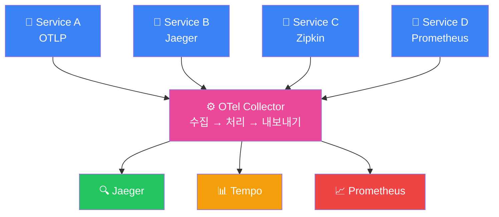
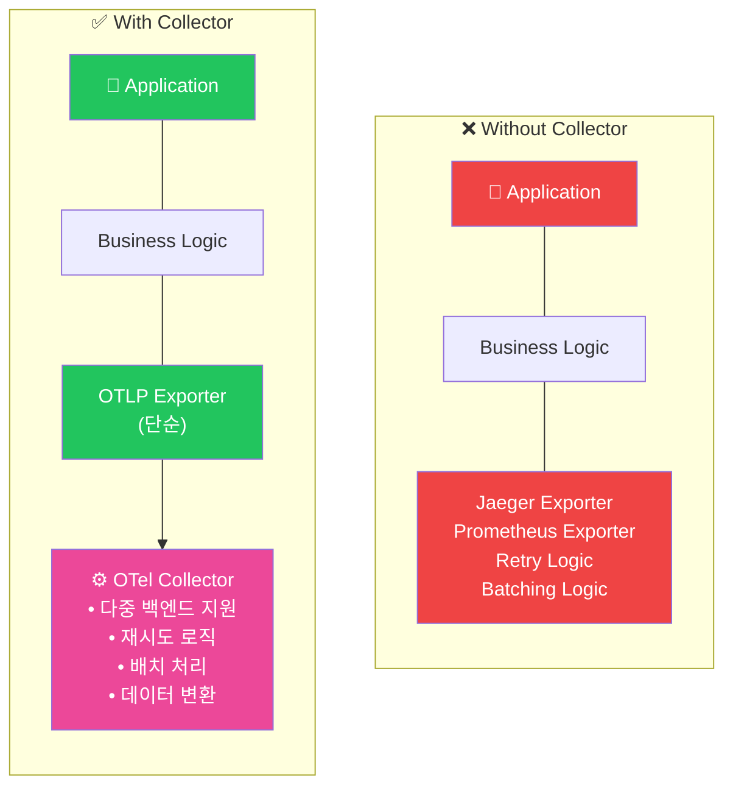
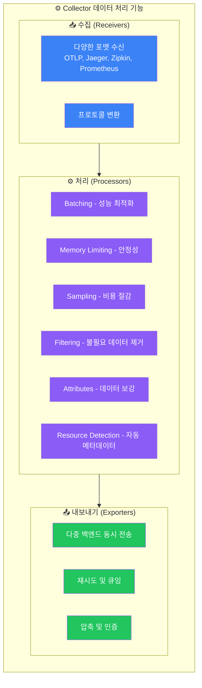
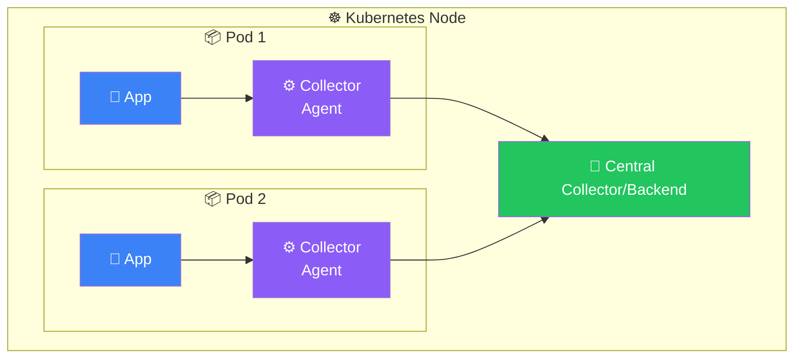
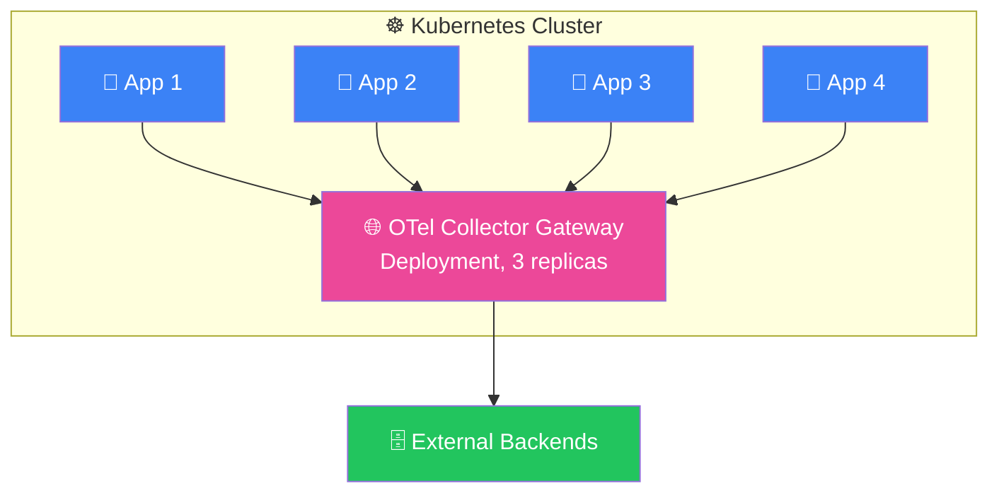
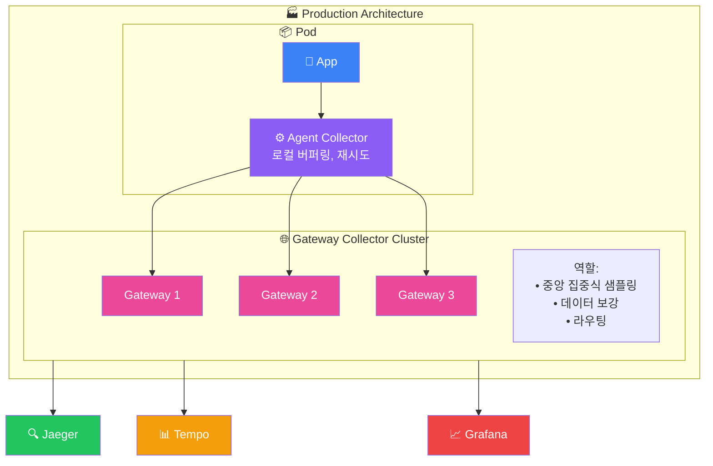

# OTel Collector 이해하기

## Collector란?

OpenTelemetry Collector는 벤더에 구애받지 않는(vendor-agnostic) 텔레메트리 데이터 수집, 처리, 내보내기 파이프라인입니다.



## Collector를 사용해야 하는 이유

### 1. 애플리케이션 분리



### 2. 백엔드 유연성

Collector가 있으면 애플리케이션 코드 변경 없이 백엔드 교체 가능:

```yaml
# Before: Jaeger만 사용
exporters:
  jaeger:
    endpoint: jaeger:14250

# After: Tempo 추가 (앱 코드 변경 없음)
exporters:
  jaeger:
    endpoint: jaeger:14250
  otlp:
    endpoint: tempo:4317
```

### 3. 데이터 처리



## Collector 배포 방식

### 1. Agent 모드 (Sidecar/DaemonSet)



**특징**:
- 각 앱과 함께 Collector 배포
- localhost 통신으로 낮은 지연
- 앱별 설정 가능

**사용 케이스**:
- 높은 처리량이 필요한 경우
- 네트워크 지연에 민감한 경우
- 앱별 다른 처리가 필요한 경우

### 2. Gateway 모드



**특징**:
- 중앙 집중식 관리
- 수평 확장 가능
- 리소스 효율적

**사용 케이스**:
- 중앙 집중식 처리가 필요한 경우
- 복잡한 라우팅 규칙이 필요한 경우
- 외부 백엔드로 내보내기 전 집계

### 3. 하이브리드 모드 (권장)



## Collector 배포판

### otel/opentelemetry-collector (Core)

- 필수 컴포넌트만 포함
- 가벼운 이미지
- 제한된 기능

```bash
docker pull otel/opentelemetry-collector:latest
```

### otel/opentelemetry-collector-contrib (Contrib)

- 모든 커뮤니티 기여 컴포넌트 포함
- 다양한 Receiver/Processor/Exporter
- 프로덕션 권장

```bash
docker pull otel/opentelemetry-collector-contrib:latest
```

### 포함 컴포넌트 비교

| 컴포넌트 | Core | Contrib |
|----------|------|---------|
| OTLP Receiver | ✅ | ✅ |
| Jaeger Receiver | ❌ | ✅ |
| Prometheus Receiver | ❌ | ✅ |
| Kafka Receiver | ❌ | ✅ |
| Batch Processor | ✅ | ✅ |
| Tail Sampling | ❌ | ✅ |
| K8s Attributes | ❌ | ✅ |
| Jaeger Exporter | ❌ | ✅ |
| Prometheus Exporter | ❌ | ✅ |

## 빠른 시작

### Docker로 실행

```yaml
# docker-compose.yml
version: '3.8'

services:
  otel-collector:
    image: otel/opentelemetry-collector-contrib:0.91.0
    command: ["--config=/etc/otel-collector-config.yaml"]
    volumes:
      - ./otel-collector-config.yaml:/etc/otel-collector-config.yaml
    ports:
      - "4317:4317"   # OTLP gRPC
      - "4318:4318"   # OTLP HTTP
      - "8888:8888"   # Metrics endpoint
      - "8889:8889"   # Prometheus exporter
      - "13133:13133" # Health check
```

### 기본 설정 파일

```yaml
# otel-collector-config.yaml
receivers:
  otlp:
    protocols:
      grpc:
        endpoint: 0.0.0.0:4317
      http:
        endpoint: 0.0.0.0:4318

processors:
  batch:
    timeout: 1s
    send_batch_size: 1024

exporters:
  logging:
    verbosity: detailed

service:
  pipelines:
    traces:
      receivers: [otlp]
      processors: [batch]
      exporters: [logging]
```

### 실행

```bash
docker-compose up -d
```

## 다음 단계

- [Collector 설정 상세](./collector-config) - 상세한 설정 방법
- [Jaeger 연동](./jaeger) - Jaeger 백엔드 연결
- [Tempo 연동](./tempo) - Grafana Tempo 연결
