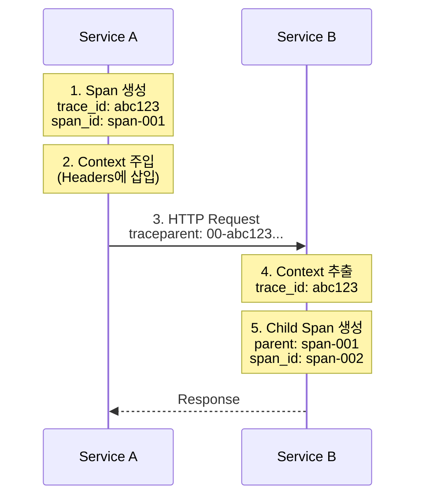

# Context Propagation

## Context Propagation이란?

**Context Propagation**은 분산 시스템에서 Trace 정보를 서비스 간에 전달하는 메커니즘입니다. 이를 통해 여러 서비스에 걸친 요청을 하나의 Trace로 연결할 수 있습니다.



> **결과**: 두 서비스의 Span이 하나의 Trace로 연결됨

## W3C Trace Context

W3C Trace Context는 분산 추적을 위한 표준 HTTP 헤더 형식입니다.

### traceparent 헤더

```
traceparent: {version}-{trace-id}-{parent-id}-{trace-flags}

예시:
```
traceparent: 00-4bf92f3577b34da6a3ce929d0e0e4736-00f067aa0ba902b7-01
```

**분석:**

| 부분 | 값 | 설명 |
|------|-----|------|
| version | `00` | 현재 버전 (2 hex) |
| trace-id | `4bf92f3577b34da6a3ce929d0e0e4736` | 전체 trace의 고유 ID (32 hex, 16 bytes) |
| parent-id | `00f067aa0ba902b7` | 현재 span의 ID (16 hex, 8 bytes) |
| trace-flags | `01` | 샘플링 여부 (01 = sampled)
```

### tracestate 헤더

벤더별 추가 정보를 전달:

```
tracestate: vendor1=value1,vendor2=value2

예시:
tracestate: congo=t61rcWkgMzE,rojo=00f067aa0ba902b7
```

## Propagator 종류

### 1. W3C Trace Context (기본, 권장)

```python
from opentelemetry.propagate import set_global_textmap
from opentelemetry.propagators.composite import CompositePropagator
from opentelemetry.trace.propagation.tracecontext import TraceContextTextMapPropagator

set_global_textmap(TraceContextTextMapPropagator())
```

### 2. B3 Propagator (Zipkin 호환)

```python
from opentelemetry.propagators.b3 import B3MultiFormat

# B3 Multi-Header 형식
# X-B3-TraceId: 80f198ee56343ba864fe8b2a57d3eff7
# X-B3-SpanId: e457b5a2e4d86bd1
# X-B3-ParentSpanId: 05e3ac9a4f6e3b90
# X-B3-Sampled: 1

set_global_textmap(B3MultiFormat())
```

### 3. Jaeger Propagator

```python
from opentelemetry.propagators.jaeger import JaegerPropagator

# uber-trace-id: {trace-id}:{span-id}:{parent-span-id}:{flags}
set_global_textmap(JaegerPropagator())
```

### 4. Composite Propagator (여러 형식 동시 지원)

```python
from opentelemetry.propagate import set_global_textmap
from opentelemetry.propagators.composite import CompositePropagator
from opentelemetry.trace.propagation.tracecontext import TraceContextTextMapPropagator
from opentelemetry.propagators.b3 import B3MultiFormat

# W3C와 B3 동시 지원
set_global_textmap(CompositePropagator([
    TraceContextTextMapPropagator(),
    B3MultiFormat(),
]))
```

## HTTP 통신에서의 Context Propagation

### Python (requests)

```python
from opentelemetry import trace
from opentelemetry.propagate import inject
import requests

tracer = trace.get_tracer(__name__)

def call_external_service():
    with tracer.start_as_current_span("call-external") as span:
        headers = {}

        # Context를 헤더에 주입
        inject(headers)

        # headers에 traceparent가 자동 추가됨
        # {'traceparent': '00-abc123...-def456...-01'}

        response = requests.get(
            "http://service-b/api/data",
            headers=headers
        )
        return response.json()
```

### Python (수신 측)

```python
from opentelemetry import trace
from opentelemetry.propagate import extract
from flask import Flask, request

app = Flask(__name__)
tracer = trace.get_tracer(__name__)

@app.route('/api/data')
def get_data():
    # 헤더에서 Context 추출
    context = extract(request.headers)

    # 추출된 context를 부모로 사용하여 span 생성
    with tracer.start_as_current_span(
        "process-request",
        context=context
    ) as span:
        # 비즈니스 로직
        return {"data": "result"}
```

### Node.js

```javascript
const { trace, propagation, context } = require('@opentelemetry/api');
const axios = require('axios');

const tracer = trace.getTracer('my-service');

async function callExternalService() {
  return tracer.startActiveSpan('call-external', async (span) => {
    const headers = {};

    // Context 주입
    propagation.inject(context.active(), headers);

    try {
      const response = await axios.get('http://service-b/api/data', {
        headers,
      });
      return response.data;
    } finally {
      span.end();
    }
  });
}
```

### Node.js (수신 측 - Express)

```javascript
const express = require('express');
const { trace, propagation, context } = require('@opentelemetry/api');

const app = express();
const tracer = trace.getTracer('my-service');

app.get('/api/data', (req, res) => {
  // 헤더에서 Context 추출
  const extractedContext = propagation.extract(context.active(), req.headers);

  // 추출된 context 내에서 span 생성
  context.with(extractedContext, () => {
    const span = tracer.startSpan('process-request');

    try {
      // 비즈니스 로직
      res.json({ data: 'result' });
    } finally {
      span.end();
    }
  });
});
```

### Java (Spring)

```java
import io.opentelemetry.api.trace.Tracer;
import io.opentelemetry.context.Context;
import io.opentelemetry.context.propagation.TextMapGetter;
import org.springframework.web.client.RestTemplate;
import org.springframework.http.HttpHeaders;

@Service
public class ExternalServiceClient {

    @Autowired
    private Tracer tracer;

    @Autowired
    private OpenTelemetry openTelemetry;

    public String callExternalService() {
        Span span = tracer.spanBuilder("call-external").startSpan();

        try (Scope scope = span.makeCurrent()) {
            HttpHeaders headers = new HttpHeaders();

            // Context 주입
            openTelemetry.getPropagators()
                .getTextMapPropagator()
                .inject(Context.current(), headers,
                    (carrier, key, value) -> carrier.add(key, value));

            RestTemplate restTemplate = new RestTemplate();
            HttpEntity<String> entity = new HttpEntity<>(headers);

            return restTemplate.exchange(
                "http://service-b/api/data",
                HttpMethod.GET,
                entity,
                String.class
            ).getBody();
        } finally {
            span.end();
        }
    }
}
```

## 메시지 큐에서의 Context Propagation

### Kafka

```python
from opentelemetry import trace
from opentelemetry.propagate import inject, extract
from kafka import KafkaProducer, KafkaConsumer

tracer = trace.get_tracer(__name__)

# Producer
def send_message(topic, message):
    with tracer.start_as_current_span(
        "kafka-produce",
        kind=trace.SpanKind.PRODUCER
    ) as span:
        span.set_attribute("messaging.system", "kafka")
        span.set_attribute("messaging.destination", topic)

        headers = {}
        inject(headers)

        # headers를 Kafka 형식으로 변환
        kafka_headers = [(k, v.encode()) for k, v in headers.items()]

        producer.send(
            topic,
            value=message.encode(),
            headers=kafka_headers
        )

# Consumer
def consume_messages(topic):
    for message in consumer:
        # Kafka 헤더를 dict로 변환
        headers = {
            k: v.decode() for k, v in message.headers
        } if message.headers else {}

        context = extract(headers)

        with tracer.start_as_current_span(
            "kafka-consume",
            context=context,
            kind=trace.SpanKind.CONSUMER
        ) as span:
            span.set_attribute("messaging.system", "kafka")
            span.set_attribute("messaging.destination", topic)

            process_message(message.value)
```

### RabbitMQ

```python
import pika
from opentelemetry import trace
from opentelemetry.propagate import inject, extract

tracer = trace.get_tracer(__name__)

# Publisher
def publish_message(routing_key, message):
    with tracer.start_as_current_span(
        "rabbitmq-publish",
        kind=trace.SpanKind.PRODUCER
    ) as span:
        headers = {}
        inject(headers)

        properties = pika.BasicProperties(headers=headers)

        channel.basic_publish(
            exchange='',
            routing_key=routing_key,
            body=message,
            properties=properties
        )

# Consumer
def callback(ch, method, properties, body):
    headers = properties.headers or {}
    context = extract(headers)

    with tracer.start_as_current_span(
        "rabbitmq-consume",
        context=context,
        kind=trace.SpanKind.CONSUMER
    ) as span:
        process_message(body)
```

## gRPC에서의 Context Propagation

### Python gRPC Client

```python
import grpc
from opentelemetry import trace
from opentelemetry.propagate import inject

tracer = trace.get_tracer(__name__)

def call_grpc_service():
    with tracer.start_as_current_span(
        "grpc-call",
        kind=trace.SpanKind.CLIENT
    ) as span:
        # 메타데이터에 context 주입
        metadata = []
        carrier = {}
        inject(carrier)

        for key, value in carrier.items():
            metadata.append((key, value))

        channel = grpc.insecure_channel('service-b:50051')
        stub = my_service_pb2_grpc.MyServiceStub(channel)

        response = stub.MyMethod(
            my_service_pb2.Request(data="hello"),
            metadata=metadata
        )
        return response
```

### Python gRPC Server (Interceptor)

```python
import grpc
from opentelemetry import trace
from opentelemetry.propagate import extract

tracer = trace.get_tracer(__name__)

class TracingInterceptor(grpc.ServerInterceptor):
    def intercept_service(self, continuation, handler_call_details):
        # 메타데이터를 dict로 변환
        metadata = dict(handler_call_details.invocation_metadata)
        context = extract(metadata)

        span = tracer.start_span(
            handler_call_details.method,
            context=context,
            kind=trace.SpanKind.SERVER
        )

        def new_handler(request, context):
            with trace.use_span(span, end_on_exit=True):
                return continuation(handler_call_details).unary_unary(
                    request, context
                )

        return grpc.unary_unary_rpc_method_handler(new_handler)
```

## 비동기/멀티스레드 환경

### Python asyncio

```python
import asyncio
from opentelemetry import trace, context as otel_context

tracer = trace.get_tracer(__name__)

async def async_operation():
    with tracer.start_as_current_span("parent"):
        # 현재 context 캡처
        ctx = otel_context.get_current()

        # 비동기 태스크에 context 전달
        await asyncio.gather(
            run_with_context(ctx, task1),
            run_with_context(ctx, task2),
        )

async def run_with_context(ctx, coro_func):
    token = otel_context.attach(ctx)
    try:
        await coro_func()
    finally:
        otel_context.detach(token)

async def task1():
    with tracer.start_as_current_span("task1"):
        await asyncio.sleep(1)

async def task2():
    with tracer.start_as_current_span("task2"):
        await asyncio.sleep(1)
```

### Python ThreadPoolExecutor

```python
from concurrent.futures import ThreadPoolExecutor
from opentelemetry import trace, context as otel_context

tracer = trace.get_tracer(__name__)

def process_items(items):
    with tracer.start_as_current_span("process-batch"):
        ctx = otel_context.get_current()

        with ThreadPoolExecutor(max_workers=4) as executor:
            futures = [
                executor.submit(process_with_context, ctx, item)
                for item in items
            ]

        for future in futures:
            future.result()

def process_with_context(ctx, item):
    token = otel_context.attach(ctx)
    try:
        with tracer.start_as_current_span(f"process-item"):
            process_item(item)
    finally:
        otel_context.detach(token)
```

## 트러블슈팅

### Context가 전파되지 않는 경우

1. **Propagator 설정 확인**
```python
from opentelemetry.propagate import get_global_textmap
print(get_global_textmap())  # 현재 propagator 확인
```

2. **헤더 확인**
```python
headers = {}
inject(headers)
print(headers)  # traceparent가 있는지 확인
```

3. **수신 측 추출 확인**
```python
context = extract(request.headers)
span = trace.get_current_span(context)
print(span.get_span_context())  # trace_id, span_id 확인
```

### 다른 시스템과의 호환성

- 기존 Zipkin 시스템: B3 propagator 사용
- 기존 Jaeger 시스템: Jaeger propagator 사용
- 혼합 환경: Composite propagator 사용

## 다음 단계

- [MSA 아키텍처](../advanced/msa-architecture) - 마이크로서비스 환경 설계
- [샘플링 전략](../advanced/sampling-strategies) - 효율적인 샘플링
