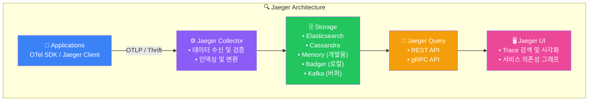
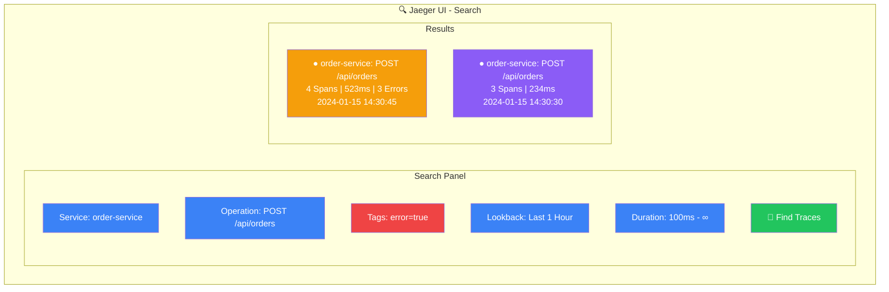
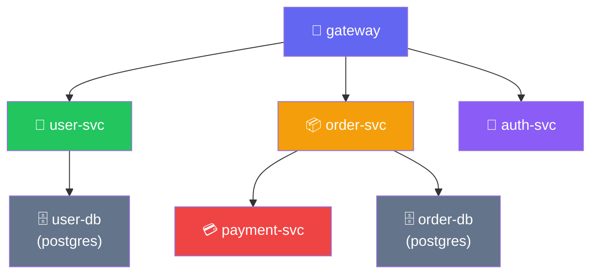

# Jaeger 연동

## Jaeger란?

**Jaeger**는 Uber에서 개발하고 CNCF에서 졸업한 오픈소스 분산 추적 시스템입니다.



## 배포 방식

### 1. All-in-One (개발/테스트용)

모든 컴포넌트가 단일 바이너리:

```yaml
# docker-compose.yml
version: '3.8'

services:
  jaeger:
    image: jaegertracing/all-in-one:1.53
    ports:
      - "16686:16686"    # Jaeger UI
      - "4317:4317"      # OTLP gRPC
      - "4318:4318"      # OTLP HTTP
      - "14268:14268"    # Jaeger Thrift HTTP
      - "14250:14250"    # Jaeger gRPC
      - "6831:6831/udp"  # Jaeger Thrift Compact
    environment:
      - COLLECTOR_OTLP_ENABLED=true
      - LOG_LEVEL=debug
```

```bash
docker-compose up -d
# UI 접속: http://localhost:16686
```

### 2. 분리 배포 (프로덕션)

```mermaid
flowchart TB
    subgraph Prod["🏭 Production Jaeger Setup"]
        Apps["📱 Applications"] --> OTel["⚙️ OTel Collector<br/>Agent/Gateway"]

        OTel --> JC["🔷 Jaeger Collector Cluster"]
        subgraph JC[" "]
            C1["Collector 1"]
            C2["Collector 2"]
            C3["Collector 3"]
        end

        JC --> ES["🗄️ Elasticsearch Cluster"]
        subgraph ES[" "]
            E1["ES 1"]
            E2["ES 2"]
            E3["ES 3"]
        end

        ES --> Query["🔎 Jaeger Query Service<br/>Load Balanced"]
        subgraph Query[" "]
            Q1["Query 1"]
            Q2["Query 2"]
        end

        Query --> UI["🖥️ Jaeger UI"]
    end

    style Apps fill:#3b82f6,color:#fff
    style OTel fill:#8b5cf6,color:#fff
    style C1 fill:#ec4899,color:#fff
    style C2 fill:#ec4899,color:#fff
    style C3 fill:#ec4899,color:#fff
    style E1 fill:#22c55e,color:#fff
    style E2 fill:#22c55e,color:#fff
    style E3 fill:#22c55e,color:#fff
    style Q1 fill:#f59e0b,color:#fff
    style Q2 fill:#f59e0b,color:#fff
    style UI fill:#ef4444,color:#fff
```



## OTel Collector와 연동

### 직접 OTLP 연결 (권장)

Jaeger 1.35+는 네이티브 OTLP 지원:

```yaml
# collector-config.yaml
receivers:
  otlp:
    protocols:
      grpc:
        endpoint: 0.0.0.0:4317
      http:
        endpoint: 0.0.0.0:4318

processors:
  batch:
    timeout: 1s
    send_batch_size: 1024

exporters:
  otlp/jaeger:
    endpoint: jaeger:4317
    tls:
      insecure: true

service:
  pipelines:
    traces:
      receivers: [otlp]
      processors: [batch]
      exporters: [otlp/jaeger]
```

### 레거시 Jaeger 프로토콜

이전 버전 Jaeger용:

```yaml
exporters:
  jaeger:
    endpoint: jaeger-collector:14250
    tls:
      insecure: true
```

## 전체 Docker Compose 설정

```yaml
# docker-compose.yml
version: '3.8'

services:
  # Jaeger All-in-One
  jaeger:
    image: jaegertracing/all-in-one:1.53
    ports:
      - "16686:16686"  # UI
      - "4317:4317"    # OTLP gRPC
      - "4318:4318"    # OTLP HTTP
    environment:
      - COLLECTOR_OTLP_ENABLED=true
      - SPAN_STORAGE_TYPE=badger
      - BADGER_EPHEMERAL=false
      - BADGER_DIRECTORY_VALUE=/badger/data
      - BADGER_DIRECTORY_KEY=/badger/key
    volumes:
      - jaeger_data:/badger

  # OTel Collector
  otel-collector:
    image: otel/opentelemetry-collector-contrib:0.91.0
    command: ["--config=/etc/otel-collector-config.yaml"]
    volumes:
      - ./otel-collector-config.yaml:/etc/otel-collector-config.yaml
    ports:
      - "4317:4317"   # OTLP gRPC (앱에서 연결)
      - "4318:4318"   # OTLP HTTP
      - "8889:8889"   # Prometheus metrics
    depends_on:
      - jaeger

  # 예제 애플리케이션
  demo-app:
    build: ./demo-app
    environment:
      - OTEL_EXPORTER_OTLP_ENDPOINT=http://otel-collector:4317
      - OTEL_SERVICE_NAME=demo-app
    ports:
      - "8080:8080"
    depends_on:
      - otel-collector

volumes:
  jaeger_data:
```

## Elasticsearch 백엔드 설정

프로덕션에서는 Elasticsearch 권장:

```yaml
# docker-compose-production.yml
version: '3.8'

services:
  elasticsearch:
    image: docker.elastic.co/elasticsearch/elasticsearch:8.11.0
    environment:
      - discovery.type=single-node
      - xpack.security.enabled=false
      - "ES_JAVA_OPTS=-Xms1g -Xmx1g"
    ports:
      - "9200:9200"
    volumes:
      - es_data:/usr/share/elasticsearch/data

  jaeger-collector:
    image: jaegertracing/jaeger-collector:1.53
    ports:
      - "4317:4317"
      - "4318:4318"
      - "14268:14268"
    environment:
      - SPAN_STORAGE_TYPE=elasticsearch
      - ES_SERVER_URLS=http://elasticsearch:9200
      - ES_INDEX_PREFIX=jaeger
      - COLLECTOR_OTLP_ENABLED=true
    depends_on:
      - elasticsearch

  jaeger-query:
    image: jaegertracing/jaeger-query:1.53
    ports:
      - "16686:16686"
      - "16687:16687"  # Admin port
    environment:
      - SPAN_STORAGE_TYPE=elasticsearch
      - ES_SERVER_URLS=http://elasticsearch:9200
      - ES_INDEX_PREFIX=jaeger
    depends_on:
      - elasticsearch

volumes:
  es_data:
```

## Jaeger UI 사용법

### 트레이스 검색



### 트레이스 상세 보기

```mermaid
gantt
    title Trace: abc123def456 - POST /api/orders (523ms)
    dateFormat X
    axisFormat %L ms

    section gateway
    POST /api/orders           :a1, 0, 523

    section user-svc
    GetUser                    :a2, 20, 176

    section user-db
    SELECT                     :a3, 50, 95

    section order-svc
    CreateOrder                :a4, 180, 492

    section payment-svc
    ProcessPayment [ERROR]     :crit, a5, 220, 409
```



**Span Details (payment-svc: ProcessPayment):**
- **Tags**: `http.method: POST`, `http.status_code: 500`, `error: true`
- **Logs**: `PaymentFailedException: Insufficient funds`

### 서비스 의존성 그래프



> **Legend**: 화살표 방향 = 요청 방향, 색상 = 에러율 (빨간색 = 높음)

## 고급 설정

### 샘플링 설정

```yaml
# Collector 측 샘플링
services:
  jaeger-collector:
    environment:
      - SAMPLING_CONFIG_TYPE=adaptive
      - SAMPLING_INITIAL_SAMPLING_PROBABILITY=0.1
```

### 인덱스 관리 (Elasticsearch)

```bash
# 오래된 인덱스 삭제
curl -X DELETE "localhost:9200/jaeger-span-2024.01.01"

# ILM(Index Lifecycle Management) 설정 권장
```

### 메트릭 모니터링

```yaml
# Prometheus로 Jaeger 메트릭 수집
scrape_configs:
  - job_name: 'jaeger'
    static_configs:
      - targets:
          - 'jaeger-collector:14269'  # Admin port
          - 'jaeger-query:16687'       # Admin port
```

## 트러블슈팅

### 트레이스가 보이지 않는 경우

1. Collector 로그 확인:
```bash
docker logs jaeger 2>&1 | grep -i error
```

2. 네트워크 연결 확인:
```bash
curl -v http://localhost:16686/api/services
```

3. 스토리지 상태 확인:
```bash
curl http://localhost:9200/_cluster/health
```

### 성능 이슈

1. 배치 설정 조정
2. Elasticsearch 튜닝
3. 샘플링률 조정

## 다음 단계

- [Tempo 연동](./tempo) - Grafana Tempo와 비교 및 연동
- [계측](./instrumentation) - 애플리케이션 계측 방법
