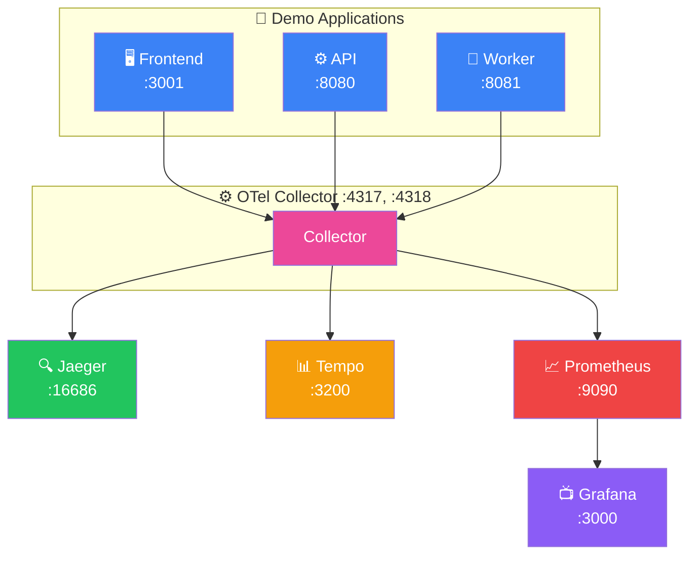

# Docker Compose 실습

이 가이드에서는 Docker Compose를 사용하여 완전한 OpenTelemetry 관측 가능성 스택을 구성합니다.

## 아키텍처



## 프로젝트 구조

```bash
mkdir otel-demo && cd otel-demo

# 디렉토리 구조 생성
mkdir -p config apps/api apps/worker
```

```
otel-demo/
├── docker-compose.yml
├── config/
│   ├── otel-collector-config.yaml
│   ├── prometheus.yml
│   ├── tempo.yaml
│   └── grafana/
│       └── provisioning/
│           └── datasources/
│               └── datasources.yaml
├── apps/
│   ├── api/
│   │   ├── Dockerfile
│   │   ├── package.json
│   │   └── index.js
│   └── worker/
│       ├── Dockerfile
│       ├── requirements.txt
│       └── main.py
└── README.md
```

## Docker Compose 파일

```yaml
# docker-compose.yml
version: '3.8'

services:
  # ============================================
  # 관측 가능성 인프라
  # ============================================

  # Jaeger - 분산 추적 UI
  jaeger:
    image: jaegertracing/all-in-one:1.53
    ports:
      - "16686:16686"  # UI
    environment:
      - COLLECTOR_OTLP_ENABLED=true
    networks:
      - otel-network

  # Tempo - 트레이스 스토리지
  tempo:
    image: grafana/tempo:2.3.1
    command: ["-config.file=/etc/tempo.yaml"]
    volumes:
      - ./config/tempo.yaml:/etc/tempo.yaml
      - tempo-data:/var/tempo
    ports:
      - "3200:3200"
    networks:
      - otel-network

  # Prometheus - 메트릭 스토리지
  prometheus:
    image: prom/prometheus:v2.48.0
    command:
      - '--config.file=/etc/prometheus/prometheus.yml'
      - '--storage.tsdb.path=/prometheus'
      - '--web.enable-remote-write-receiver'
      - '--enable-feature=exemplar-storage'
    volumes:
      - ./config/prometheus.yml:/etc/prometheus/prometheus.yml
      - prometheus-data:/prometheus
    ports:
      - "9090:9090"
    networks:
      - otel-network

  # OTel Collector
  otel-collector:
    image: otel/opentelemetry-collector-contrib:0.91.0
    command: ["--config=/etc/otel-collector-config.yaml"]
    volumes:
      - ./config/otel-collector-config.yaml:/etc/otel-collector-config.yaml
    ports:
      - "4317:4317"   # OTLP gRPC
      - "4318:4318"   # OTLP HTTP
      - "8889:8889"   # Prometheus metrics
    depends_on:
      - jaeger
      - tempo
      - prometheus
    networks:
      - otel-network

  # Grafana - 대시보드
  grafana:
    image: grafana/grafana:10.2.0
    ports:
      - "3000:3000"
    environment:
      - GF_AUTH_ANONYMOUS_ENABLED=true
      - GF_AUTH_ANONYMOUS_ORG_ROLE=Admin
      - GF_AUTH_DISABLE_LOGIN_FORM=true
    volumes:
      - ./config/grafana/provisioning:/etc/grafana/provisioning
      - grafana-data:/var/lib/grafana
    depends_on:
      - prometheus
      - tempo
      - jaeger
    networks:
      - otel-network

  # ============================================
  # 데모 애플리케이션
  # ============================================

  # API 서비스 (Node.js)
  api:
    build: ./apps/api
    ports:
      - "8080:8080"
    environment:
      - OTEL_SERVICE_NAME=api-service
      - OTEL_EXPORTER_OTLP_ENDPOINT=http://otel-collector:4317
      - OTEL_EXPORTER_OTLP_PROTOCOL=grpc
      - WORKER_URL=http://worker:8081
    depends_on:
      - otel-collector
      - worker
    networks:
      - otel-network

  # Worker 서비스 (Python)
  worker:
    build: ./apps/worker
    ports:
      - "8081:8081"
    environment:
      - OTEL_SERVICE_NAME=worker-service
      - OTEL_EXPORTER_OTLP_ENDPOINT=http://otel-collector:4317
      - OTEL_EXPORTER_OTLP_PROTOCOL=grpc
    depends_on:
      - otel-collector
    networks:
      - otel-network

networks:
  otel-network:
    driver: bridge

volumes:
  tempo-data:
  prometheus-data:
  grafana-data:
```

## 설정 파일

### OTel Collector 설정

```yaml
# config/otel-collector-config.yaml
receivers:
  otlp:
    protocols:
      grpc:
        endpoint: 0.0.0.0:4317
      http:
        endpoint: 0.0.0.0:4318

processors:
  batch:
    timeout: 1s
    send_batch_size: 1024

  memory_limiter:
    check_interval: 1s
    limit_mib: 1000

  resource:
    attributes:
      - key: deployment.environment
        value: docker-compose
        action: insert

exporters:
  # Jaeger로 트레이스 전송
  otlp/jaeger:
    endpoint: jaeger:4317
    tls:
      insecure: true

  # Tempo로 트레이스 전송
  otlp/tempo:
    endpoint: tempo:4317
    tls:
      insecure: true

  # Prometheus 메트릭 노출
  prometheus:
    endpoint: 0.0.0.0:8889
    namespace: otel

  # 디버그 로깅
  debug:
    verbosity: detailed

service:
  pipelines:
    traces:
      receivers: [otlp]
      processors: [memory_limiter, resource, batch]
      exporters: [otlp/jaeger, otlp/tempo, debug]

    metrics:
      receivers: [otlp]
      processors: [memory_limiter, batch]
      exporters: [prometheus]
```

### Tempo 설정

```yaml
# config/tempo.yaml
stream_over_http_enabled: true

server:
  http_listen_port: 3200
  grpc_listen_port: 9095

distributor:
  receivers:
    otlp:
      protocols:
        grpc:
          endpoint: 0.0.0.0:4317

ingester:
  max_block_duration: 5m

compactor:
  compaction:
    block_retention: 24h

storage:
  trace:
    backend: local
    wal:
      path: /var/tempo/wal
    local:
      path: /var/tempo/blocks
```

### Prometheus 설정

```yaml
# config/prometheus.yml
global:
  scrape_interval: 15s
  evaluation_interval: 15s

scrape_configs:
  - job_name: 'prometheus'
    static_configs:
      - targets: ['localhost:9090']

  - job_name: 'otel-collector'
    static_configs:
      - targets: ['otel-collector:8889']
```

### Grafana 데이터소스 설정

```yaml
# config/grafana/provisioning/datasources/datasources.yaml
apiVersion: 1

datasources:
  - name: Prometheus
    type: prometheus
    access: proxy
    url: http://prometheus:9090
    isDefault: true

  - name: Tempo
    type: tempo
    access: proxy
    url: http://tempo:3200
    jsonData:
      httpMethod: GET
      tracesToMetrics:
        datasourceUid: prometheus
        tags: [{ key: 'service.name', value: 'service' }]
      serviceMap:
        datasourceUid: prometheus
      nodeGraph:
        enabled: true

  - name: Jaeger
    type: jaeger
    access: proxy
    url: http://jaeger:16686
```

## 데모 애플리케이션

### Node.js API 서비스

```javascript
// apps/api/index.js
const express = require('express');
const axios = require('axios');

// OpenTelemetry 설정
const { NodeSDK } = require('@opentelemetry/sdk-node');
const { getNodeAutoInstrumentations } = require('@opentelemetry/auto-instrumentations-node');
const { OTLPTraceExporter } = require('@opentelemetry/exporter-trace-otlp-grpc');
const { OTLPMetricExporter } = require('@opentelemetry/exporter-metrics-otlp-grpc');
const { PeriodicExportingMetricReader } = require('@opentelemetry/sdk-metrics');
const { Resource } = require('@opentelemetry/resources');
const { SemanticResourceAttributes } = require('@opentelemetry/semantic-conventions');
const { trace } = require('@opentelemetry/api');

const sdk = new NodeSDK({
  resource: new Resource({
    [SemanticResourceAttributes.SERVICE_NAME]: process.env.OTEL_SERVICE_NAME || 'api-service',
    [SemanticResourceAttributes.SERVICE_VERSION]: '1.0.0',
  }),
  traceExporter: new OTLPTraceExporter(),
  metricReader: new PeriodicExportingMetricReader({
    exporter: new OTLPMetricExporter(),
    exportIntervalMillis: 10000,
  }),
  instrumentations: [getNodeAutoInstrumentations()],
});

sdk.start();

const app = express();
const tracer = trace.getTracer('api-service');
const WORKER_URL = process.env.WORKER_URL || 'http://localhost:8081';

app.use(express.json());

// 헬스체크
app.get('/health', (req, res) => {
  res.json({ status: 'healthy' });
});

// 주문 생성
app.post('/api/orders', async (req, res) => {
  const span = tracer.startSpan('create-order');

  try {
    span.setAttribute('order.items', req.body.items?.length || 0);

    // Worker 서비스 호출
    const workerResponse = await axios.post(`${WORKER_URL}/process`, {
      type: 'order',
      data: req.body,
    });

    span.setAttribute('worker.status', workerResponse.status);

    res.json({
      orderId: `order-${Date.now()}`,
      status: 'created',
      workerResult: workerResponse.data,
    });
  } catch (error) {
    span.recordException(error);
    res.status(500).json({ error: error.message });
  } finally {
    span.end();
  }
});

// 사용자 조회
app.get('/api/users/:id', async (req, res) => {
  const span = tracer.startSpan('get-user');

  try {
    span.setAttribute('user.id', req.params.id);

    // 시뮬레이션된 DB 조회
    await new Promise(resolve => setTimeout(resolve, 50));

    res.json({
      id: req.params.id,
      name: `User ${req.params.id}`,
      email: `user${req.params.id}@example.com`,
    });
  } finally {
    span.end();
  }
});

// 에러 테스트
app.get('/api/error', (req, res) => {
  const span = tracer.startSpan('error-test');

  try {
    throw new Error('Intentional error for testing');
  } catch (error) {
    span.recordException(error);
    res.status(500).json({ error: error.message });
  } finally {
    span.end();
  }
});

const PORT = process.env.PORT || 8080;
app.listen(PORT, () => {
  console.log(`API service running on port ${PORT}`);
});

process.on('SIGTERM', () => {
  sdk.shutdown().then(() => process.exit(0));
});
```

```json
// apps/api/package.json
{
  "name": "api-service",
  "version": "1.0.0",
  "main": "index.js",
  "scripts": {
    "start": "node index.js"
  },
  "dependencies": {
    "express": "^4.18.2",
    "axios": "^1.6.2",
    "@opentelemetry/api": "^1.7.0",
    "@opentelemetry/sdk-node": "^0.46.0",
    "@opentelemetry/auto-instrumentations-node": "^0.41.0",
    "@opentelemetry/exporter-trace-otlp-grpc": "^0.46.0",
    "@opentelemetry/exporter-metrics-otlp-grpc": "^0.46.0",
    "@opentelemetry/sdk-metrics": "^1.18.0",
    "@opentelemetry/resources": "^1.18.0",
    "@opentelemetry/semantic-conventions": "^1.18.0"
  }
}
```

```dockerfile
# apps/api/Dockerfile
FROM node:20-alpine
WORKDIR /app
COPY package*.json ./
RUN npm install
COPY . .
EXPOSE 8080
CMD ["npm", "start"]
```

### Python Worker 서비스

```python
# apps/worker/main.py
import time
import random
from flask import Flask, request, jsonify
from opentelemetry import trace
from opentelemetry.sdk.trace import TracerProvider
from opentelemetry.sdk.trace.export import BatchSpanProcessor
from opentelemetry.exporter.otlp.proto.grpc.trace_exporter import OTLPSpanExporter
from opentelemetry.sdk.resources import Resource, SERVICE_NAME, SERVICE_VERSION
from opentelemetry.instrumentation.flask import FlaskInstrumentor
from opentelemetry.instrumentation.requests import RequestsInstrumentor
import os

# 리소스 설정
resource = Resource.create({
    SERVICE_NAME: os.getenv("OTEL_SERVICE_NAME", "worker-service"),
    SERVICE_VERSION: "1.0.0"
})

# Tracer Provider 설정
provider = TracerProvider(resource=resource)
exporter = OTLPSpanExporter(
    endpoint=os.getenv("OTEL_EXPORTER_OTLP_ENDPOINT", "http://localhost:4317"),
    insecure=True
)
provider.add_span_processor(BatchSpanProcessor(exporter))
trace.set_tracer_provider(provider)

tracer = trace.get_tracer(__name__)

app = Flask(__name__)

# 자동 계측
FlaskInstrumentor().instrument_app(app)
RequestsInstrumentor().instrument()


@app.route('/health')
def health():
    return jsonify({"status": "healthy"})


@app.route('/process', methods=['POST'])
def process():
    data = request.json

    with tracer.start_as_current_span("process-task") as span:
        span.set_attribute("task.type", data.get("type", "unknown"))

        # 데이터 검증
        with tracer.start_as_current_span("validate-data"):
            time.sleep(random.uniform(0.01, 0.05))

        # 처리 시뮬레이션
        with tracer.start_as_current_span("execute-task") as task_span:
            processing_time = random.uniform(0.1, 0.5)
            task_span.set_attribute("processing.duration_ms", processing_time * 1000)
            time.sleep(processing_time)

            # 랜덤 에러 (10% 확률)
            if random.random() < 0.1:
                raise Exception("Random processing error")

        # 결과 저장
        with tracer.start_as_current_span("save-result"):
            time.sleep(random.uniform(0.02, 0.08))

        return jsonify({
            "status": "processed",
            "taskId": f"task-{int(time.time() * 1000)}",
            "processingTime": processing_time
        })


@app.errorhandler(Exception)
def handle_error(error):
    span = trace.get_current_span()
    if span:
        span.record_exception(error)
    return jsonify({"error": str(error)}), 500


if __name__ == '__main__':
    app.run(host='0.0.0.0', port=8081)
```

```txt
# apps/worker/requirements.txt
flask==3.0.0
opentelemetry-api==1.22.0
opentelemetry-sdk==1.22.0
opentelemetry-exporter-otlp-proto-grpc==1.22.0
opentelemetry-instrumentation-flask==0.43b0
opentelemetry-instrumentation-requests==0.43b0
```

```dockerfile
# apps/worker/Dockerfile
FROM python:3.11-slim
WORKDIR /app
COPY requirements.txt .
RUN pip install --no-cache-dir -r requirements.txt
COPY . .
EXPOSE 8081
CMD ["python", "main.py"]
```

## 실행 및 테스트

### 실행

```bash
# 모든 서비스 시작
docker-compose up -d

# 로그 확인
docker-compose logs -f

# 특정 서비스 로그
docker-compose logs -f otel-collector
```

### 테스트

```bash
# 주문 생성
curl -X POST http://localhost:8080/api/orders \
  -H "Content-Type: application/json" \
  -d '{"items": [{"name": "Widget", "qty": 2}]}'

# 사용자 조회
curl http://localhost:8080/api/users/123

# 에러 테스트
curl http://localhost:8080/api/error

# 부하 테스트
for i in {1..100}; do
  curl -s http://localhost:8080/api/orders \
    -X POST -H "Content-Type: application/json" \
    -d '{"items": [{"name": "Item'$i'"}]}' &
done
wait
```

### UI 접속

- **Jaeger UI**: http://localhost:16686
- **Grafana**: http://localhost:3000
- **Prometheus**: http://localhost:9090

## 다음 단계

- [Kubernetes 배포](./kubernetes-deployment) - K8s 환경 배포
- [Node.js 예제](./nodejs-example) - 상세한 Node.js 계측
